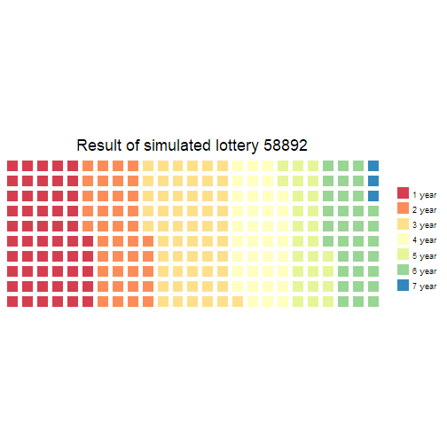
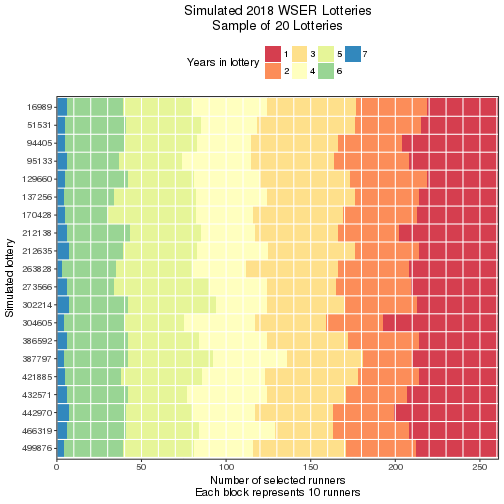

Load packages.


```r
library(parallel)
library(doParallel)
library(data.table)
library(reshape2)
library(ggplot2)
library(RColorBrewer)
library(waffle)
library(xtable)
library(knitr)
library(rmarkdown)
```

Parameters to update.
Source: [2018 WSER Lottery Entrants](http://www.wser.org/lottery2018.html).

> Total Tickets: 15066     Total Entrants: 4921
> 
> Last Updated: 11-20-2017 21:41:19 PST
> 
> Years (Tickets) | Entrants| Tickets
> :--------------:|:-------:|:------:
> 7 (64) |    8 |  512
> 6 (32) |   71 | 2272
> 5 (16) |  161 | 2576
> 4 (8)  |  282 | 2256
> 3 (4)  |  665 | 2660
> 2 (2)  | 1056 | 2112
> 1 (1)  | 2678 | 2678


```r
distn <- c(2678, 1056, 665, 282, 161, 71, 8)  # Number of entrants for each ticket count
spots <- 250  # Number of spots up for grabs
size <- 1E5  # Use 1E5 for production, 1E3 for testing
dateLottery <- as.Date("2017-12-02", format="%Y-%m-%d")  # Random number seed; use lottery date
```

# Simulation

Here, I run a simulation of the lottery process to estimate probabilities of
winning a slot for the Western States Endurance Run. The simulation does a few
things

* Use the `sample` function in R to sample without replacement using the
  number of tickets each entrant has divided by the total number of tickets in
  the *hat* as each entrant's selection probability for a single draw
* Select draws from the *hat* equal to the number of spots available
* Repeat each *lottery* a number of times
* Use the `aggregate` function to summarize the simulations and derive an
  emperical distribution of selection probabilities
* Plot the selection probability distributions

## Set up initial conditions

Here is the code to set up the lottery hat data frame at the initial state.
Print out some validation output just to make sure the initial state is set up
correctly.


```r
applicants <- sum(distn)
runner <- seq(1, applicants)
year <- c(rep(7, distn[7]),
          rep(6, distn[6]),
          rep(5, distn[5]),
          rep(4, distn[4]),
          rep(3, distn[3]),
          rep(2, distn[2]),
          rep(1, distn[1]))
tickets <- 2^(year - 1)
frameHat <- data.frame(runner, year, tickets)
frameHat$prob <- frameHat$tickets / sum(frameHat$tickets)
addmargins(table(factor(frameHat$tickets)))  # Check for match with `distn` vector
```

```
## 
##    1    2    4    8   16   32   64  Sum 
## 2678 1056  665  282  161   71    8 4921
```

```r
kable(aggregate(prob ~ tickets, frameHat, mean))  # Check success probabilities of an individual draw
```


| tickets|      prob|
|-------:|---------:|
|       1| 0.0000664|
|       2| 0.0001327|
|       4| 0.0002655|
|       8| 0.0005310|
|      16| 0.0010620|
|      32| 0.0021240|
|      64| 0.0042480|

## Simulate lottery

The simulation needs to account for the changing relative distribution of
tickets after a person is selected and their tickets are no longer in the pool
of eligible tickets.

The matrix `lottery` is an $I \times J$ matrix where row $i$ is the $i$-th
simulation and the column $j$ is the $j$-th lottery winner drawn. The number
of columns in the matrix is 250, variable `spots`. The number of
simulated lotteries is variable `size`. Set the random number seed as the date
of the lottery in numeric form multipied by the number of applicants.


```r
set.seed(as.numeric(dateLottery) * applicants)
cores <- min(detectCores(), 4)
cl <- makeCluster(cores)
registerDoParallel(cl)
simTime <- system.time(
  lottery <- foreach (i=1:size, .combine=rbind) %dopar% {
    sample(frameHat$runner, spots, prob=frameHat$prob)
  }
)
stopCluster(cl)
```

## One simulated lottery


```r
i <- sample(seq(1, size), 1)
sampLottery <- list(i, sort(lottery[i, ]))
names(sampLottery) <- c("lottery", "runner")
sampLottery
```

```
## $lottery
## [1] 58892
## 
## $runner
##   [1]    2    3    4    9   10   13   15   16   20   22   27   29   30   31
##  [15]   32   35   40   41   42   44   46   48   49   50   52   54   58   60
##  [29]   63   65   66   67   70   72   75   77   89   99  101  105  108  118
##  [43]  121  124  128  129  134  138  178  182  191  195  197  202  208  211
##  [57]  212  213  214  224  235  236  244  247  261  276  277  294  308  310
##  [71]  314  315  316  331  333  340  350  352  354  359  365  382  384  386
##  [85]  389  390  399  402  405  415  431  432  450  470  481  496  504  512
##  [99]  520  552  556  558  565  573  574  578  598  603  607  612  621  671
## [113]  694  702  714  720  727  752  763  772  818  826  832  838  847  858
## [127]  864  868  869  874  875  894  925  929  943  944  956  961  962  993
## [141]  994 1003 1004 1008 1012 1035 1042 1060 1085 1095 1134 1140 1151 1181
## [155] 1187 1207 1209 1231 1289 1306 1325 1357 1358 1374 1396 1424 1445 1449
## [169] 1476 1501 1546 1558 1566 1587 1591 1614 1623 1660 1676 1698 1778 1783
## [183] 1784 1814 1896 2057 2091 2095 2101 2107 2152 2169 2175 2191 2204 2312
## [197] 2370 2398 2464 2475 2515 2516 2521 2547 2576 2671 2676 2783 2786 2799
## [211] 2929 3009 3137 3142 3238 3342 3389 3431 3434 3484 3502 3542 3636 3736
## [225] 3772 3785 3799 3817 3825 3838 3964 3978 3984 3985 4008 4022 4052 4164
## [239] 4205 4261 4305 4317 4363 4395 4404 4593 4651 4783 4862 4886
```

Here's the distribution of the category of ticket holders from that random
simulated lottery.
I.e., in simulated lottery 58892, 


```r
agg1 <- data.frame(addmargins(table(frameHat$year[sampLottery$runner])))
agg1$year <- as.numeric(agg1$Var1)
agg1$tickets <- 2 ^ (agg1$year - 1)
agg1[agg1$Var1 == "Sum", ]$year <- NA
agg1[agg1$Var1 == "Sum", ]$tickets <- NA
agg1 <- agg1[, c("year", "tickets", "Freq")]
freq <- agg1[!is.na(agg1$year), "Freq"]
names(freq) <- sprintf("%d year", agg1[!is.na(agg1$year), "year"])
waffle(freq, 
       title = sprintf("Result of simulated lottery %d", i),
       colors = brewer.pal(length(freq), "Spectral")) +
  theme(plot.title = element_text(hjust = 0.5))
```



Okay... but what happened with the other 99999 simulated lotteries?

## Format lottery simulation data

I'm not really interested in which runners were selected in the lottery
simulation. What I'm really after are estimates for the probability of
selecting a runner, among the 250 available spots, with $X$ tickets in
the initial hat.

To get at this, first I'll have to match the runners selected to the number of
tickets they started out with.


```r
cl <- makeCluster(cores)
registerDoParallel(cl)
lottery2 <- foreach (i=1:size, .combine=rbind) %dopar% {
  frameHat$year[lottery[i, ]]
}
stopCluster(cl)
```

Reformat the `lottery2` matrix to an aggregated data frame for analysis.


```r
year <- factor(as.vector(t(lottery2)))
sim <- rep(seq(1, size), each=spots)
frameLottery <- data.table(sim, year)
aggTime <- system.time(
  aggLottery <- frameLottery[,
                             list(year1 = sum(year == 1),
                                  year2 = sum(year == 2),
                                  year3 = sum(year == 3),
                                  year4 = sum(year == 4),
                                  year5 = sum(year == 5),
                                  year6 = sum(year == 6),
                                  year7 = sum(year == 7)),
                             sim]
)
nlev <- nlevels(frameLottery$year)
sim <- rep(seq(1, size), each=nlev)
year <- factor(rep(seq(1, nlev), size))
freq <- as.vector(t(aggLottery[, list(year1, 
                                      year2, 
                                      year3, 
                                      year4, 
                                      year5, 
                                      year6, 
                                      year7)]))
frameSummary <- data.frame(sim, year, freq)
frameSummary <- melt(aggLottery, id.vars=c("sim"))
frameSummary$year <- factor(gsub("year", "", frameSummary$variable))
frameSummary$freq <- frameSummary$value
frameSummary[, c("variable", "value")] <- NULL
frameSummary <- frameSummary[order(frameSummary$sim, frameSummary$year)]
```

Save the aggregated data frame for other analysis.


```r
save(aggLottery, file="aggLottery.RData")
```

For each type of lottery applicant (1 ticket, 2 tickets, etc.), calculate the
proportion of selected applicants.


```r
total <- rep(distn, size)
frameSummary$prob <- 100 * (frameSummary$freq / total)
aggFx <- function(x) {c(mean = mean(x), median = median(x), sd = sd(x))}
aggProb <- aggregate(prob ~ year, frameSummary, aggFx)
ev <- distn * aggProb[, "prob"][, "mean"] / 100
simsum <- data.frame(year = aggProb[, "year"], 
                     nTickets = 2 ^ (as.numeric(aggProb[, "year"]) - 1),
                     distn, 
                     mean = aggProb[, "prob"][, "mean"], 
                     ev)
names(simsum) <- c("Years in lottery", 
                   "Number of tickets",
                   "N", 
                   "Mean probability of selection", 
                   "Expected value")
```

# Summarize lottery simulations

Plot the distribution of probabilities from the 100,000
simulated lotteries.

## Probability of selection


```r
title <- sprintf("%.0d WSER Lottery Selection Probability Densities", as.numeric(format(dateLottery, "%Y")) + 1)
xlab <- "Probability of selection"
options(scipen=999)
ylab <- paste("Proportion of", format(size, big.mark=",", digits=0), "simulations")
filllab <- "Years in lottery"
annolab <- sprintf("%.2f%%", simsum$"Mean probability of selection")
y1 <- max(density(frameSummary$prob[frameSummary$year == 1])$y)
y2 <- max(density(frameSummary$prob[frameSummary$year == 2])$y)
y3 <- max(density(frameSummary$prob[frameSummary$year == 3])$y)
y4 <- max(density(frameSummary$prob[frameSummary$year == 4])$y)
y5 <- max(density(frameSummary$prob[frameSummary$year == 5])$y)
y6 <- max(density(frameSummary$prob[frameSummary$year == 6])$y)
y7 <- max(density(frameSummary$prob[frameSummary$year == 7])$y)
y <- c(y1, y2, y3, y4, y5, y6, y7)
ggplot(frameSummary, aes(x = year, y = prob / 100, fill = year)) +
  geom_violin() +
  scale_fill_brewer(palette="Spectral") + 
  scale_y_continuous(trans = "logit") + 
  labs(title=title, x=filllab, y=xlab, fill=filllab) +
  annotate("text", label=annolab, y=simsum$"Mean probability of selection" / 100, x=c(1:5+0.6, 6-0.5, 7 - 0.4)) +
  theme(legend.position = "none",
        plot.title = element_text(hjust = 0.5))
```

```
## Warning: Transformation introduced infinite values in continuous y-axis
```

```
## Warning: Removed 5137 rows containing non-finite values (stat_ydensity).
```


As expected, the spread of the selection probabilities increases as the number
of tickets a person has in the hat increases (the variance of a binomial
random variable increases with $p$).

## Number of entrants

Another way to think about the lottery is to plot the distribution of the
frequency of runners selected by number of tickets.


```r
title <- sprintf("%.0d WSER Lottery Selection Distribution Densities", as.numeric(format(dateLottery, "%Y")) + 1)
xlab <- "Number of entrants selected"
ylab <- paste("Proportion of", format(size, big.mark=",", digits=0), "simulations")
filllab <- "Years in lottery"
annolab <- sprintf("%.1f", simsum$"Expected value")
y1 <- max(density(frameSummary$freq[frameSummary$year == 1])$y)
y2 <- max(density(frameSummary$freq[frameSummary$year == 2])$y)
y3 <- max(density(frameSummary$freq[frameSummary$year == 3])$y)
y4 <- max(density(frameSummary$freq[frameSummary$year == 4])$y)
y5 <- max(density(frameSummary$freq[frameSummary$year == 5])$y)
y6 <- max(density(frameSummary$freq[frameSummary$year == 6])$y)
y7 <- max(density(frameSummary$freq[frameSummary$year == 7])$y)
y <- c(y1, y2, y3, y4, y5, y6, y7)
ggplot(frameSummary, aes(x = year, y = freq, fill = year)) +
  geom_violin() +
  scale_fill_brewer(palette="Spectral") + 
  scale_y_sqrt() + 
  labs(title=title, x=filllab, y=xlab, fill=filllab) +
  annotate("text", label=annolab, y=simsum$"Expected value", x=c(1:6+0.3, 7-0.6)) +
  theme(legend.position = "none",
        plot.title = element_text(hjust = 0.5))
```


## Probability all 64-ticket holders are selected


```r
df <- aggregate(sim ~ freq, frameSummary[year == nlev, ], length)
nsim <- df[df$freq == max(df$freq), "sim"]
```

The probability all 64-ticket holders are selected is 
5.12%.


# Outcome of sample of lotteries

Estimated from 100,000 simulated lotteries.

## Sample of simulated lotteries


```r
s <- 20
title <- sprintf("Simulated %.0d WSER Lotteries\nSample of %.0f Lotteries", as.numeric(format(dateLottery, "%Y")) + 1, s)
xlab <- "Simulated lottery"
ylab <- "Number of selected runners\nEach block represents 10 runners"
filllab <- "Years in lottery"
i <- sample(seq(1, size), s)
frameSample <- frameLottery[frameLottery$sim %in% i, ]
frameSample$sim <- factor(frameSample$sim)
levels(frameSample$sim) <- rev(levels(frameSample$sim))
ggplot(frameSample, aes(x=sim, fill=year)) +
  geom_bar(width=1) +
  geom_hline(yintercept = seq(0, spots, 10), color="white") +
  geom_vline(xintercept = seq(1, s)-0.5, color="white") +
  scale_fill_brewer(palette="Spectral") +
  scale_y_continuous(expand=c(0, 0)) +
  labs(title=title, x=xlab, y=ylab, fill=filllab) +
  coord_flip() +
  theme_bw() +
  theme(legend.position="top",
        plot.title = element_text(hjust = 0.5))
```




# Details

Go to my [WSERLottery](https://github.com/benjamin-chan/WSERLottery) repository for the gory details.


# Session info


```
## Timestamp: 2017-11-20 22:57:58
```

```
## Number of cores used in simulation: 2
```

```
## Random number seed: 86127342
```

```
## Elapsed time of simulation: 4.951 minutes
```

```
## Elapsed time of aggregation: 0.652 minutes
```

```
## R version 3.4.2 (2017-09-28)
## Platform: x86_64-w64-mingw32/x64 (64-bit)
## Running under: Windows >= 8 x64 (build 9200)
## 
## Matrix products: default
## 
## attached base packages:
## [1] parallel  stats     graphics  grDevices utils     datasets  methods  
## [8] base     
## 
## other attached packages:
##  [1] RColorBrewer_1.1-2  waffle_0.7.0        rmarkdown_1.6      
##  [4] knitr_1.17          xtable_1.8-2        ggplot2_2.2.1      
##  [7] reshape2_1.4.2      data.table_1.10.4-3 doParallel_1.0.11  
## [10] iterators_1.0.8     foreach_1.4.3       checkpoint_0.4.2   
## 
## loaded via a namespace (and not attached):
##  [1] Rcpp_0.12.13     Rttf2pt1_1.3.4   magrittr_1.5     munsell_0.4.3   
##  [5] colorspace_1.3-2 rlang_0.1.2      highr_0.6        stringr_1.2.0   
##  [9] plyr_1.8.4       tools_3.4.2      grid_3.4.2       gtable_0.2.0    
## [13] extrafontdb_1.0  htmltools_0.3.6  rprojroot_1.2    digest_0.6.12   
## [17] yaml_2.1.14      lazyeval_0.2.1   tibble_1.3.4     gridExtra_2.3   
## [21] codetools_0.2-15 evaluate_0.10.1  labeling_0.3     stringi_1.1.5   
## [25] compiler_3.4.2   backports_1.1.1  scales_0.5.0     extrafont_0.17
```

```
##        sysname        release        version       nodename        machine 
##      "Windows"     ">= 8 x64"   "build 9200"     "FAMILYPC"       "x86-64" 
##          login           user effective_user 
##          "Ben"          "Ben"          "Ben"
```
