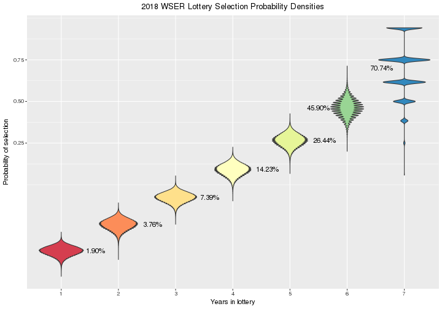
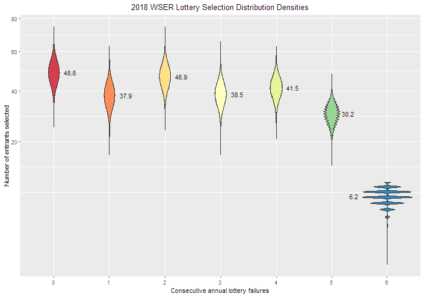
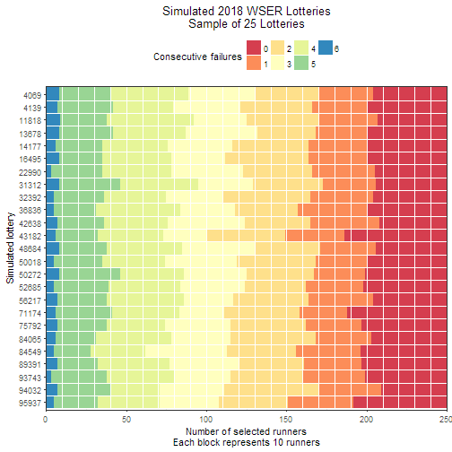

Load packages.


```r
library(parallel)
library(doParallel)
library(data.table)
library(reshape2)
library(ggplot2)
library(xtable)
library(knitr)
library(rmarkdown)
```

Parameters to update.

> Total Tickets: 15061     Total Entrants: 4926
> 
> Last Updated: 11-19-2017 07:45:18 PST
> 
> Years (Tickets) | Entrants| Tickets
> ----------------|---------|--------
> 7 (64) |    9 |  576
> 6 (32) |   68 | 2176
> 5 (16) |  163 | 2608
> 4 ( 8) |  282 | 2256
> 3 ( 4) |  663 | 2652
> 2 ( 2) | 1052 | 2104
> 1 ( 1) | 2689 | 2689


```r
distn <- c(2689, 1052, 663, 282, 163, 68, 9)  # Number of entrants for each ticket count
probWSER <- c(2.502, 4.940, 9.649, 18.358, 33.345, 55.581, 80.203)  # Selection probabilities from WSER
                                                                    # Not necessary for simulation
                                                                    # Only used to comparison
spots <- 250  # Number of spots up for grabs
size <- 1E5  # Use 1E5 for production, 1E3 for testing
dateLottery <- as.Date("2017-12-02", format="%Y-%m-%d")  # Random number seed; use lottery date
```

# Simulation

Here, I run a simulation of the lottery process to estimate probabilities of
winning a slot for the Western States Endurance Run. The simulation does a few
things

* Use the `sample` function in R to sample without replacement using the
  number of tickets each entrant has divided by the total number of tickets in
  the *hat* as each entrant's selection probability for a single draw
* Select draws from the *hat* equal to the number of spots available
* Repeat each *lottery* a number of times
* Use the `aggregate` function to summarize the simulations and derive an
  emperical distribution of selection probabilities
* Plot the selection probability distributions

## Set up initial conditions

Here is the code to set up the lottery hat data frame at the initial state.
Print out some validation output just to make sure the initial state is set up
correctly.


```r
applicants <- sum(distn)
runner <- seq(1, applicants)
confail <- c(rep(6, distn[7]),
             rep(5, distn[6]),
             rep(4, distn[5]),
             rep(3, distn[4]),
             rep(2, distn[3]),
             rep(1, distn[2]),
             rep(0, distn[1]))
tickets <- 2^confail
frameHat <- data.frame(runner, confail, tickets)
frameHat$prob <- frameHat$tickets / sum(frameHat$tickets)
addmargins(table(factor(frameHat$tickets)))  # Check for match with `distn` vector
```

```
## 
##    1    2    4    8   16   32   64  Sum 
## 2689 1052  663  282  163   68    9 4926
```

```r
kable(aggregate(prob ~ tickets, frameHat, mean))  # Check success probabilities of an individual draw
```


| tickets|      prob|
|-------:|---------:|
|       1| 0.0000664|
|       2| 0.0001328|
|       4| 0.0002656|
|       8| 0.0005312|
|      16| 0.0010623|
|      32| 0.0021247|
|      64| 0.0042494|

## Simulate lottery

The simulation needs to account for the changing relative distribution of
tickets after a person is selected and their tickets are no longer in the pool
of eligible tickets.

The matrix `lottery` is an $I \times J$ matrix where row $i$ is the $i$-th
simulation and the column $j$ is the $j$-th lottery winner drawn. The number
of columns in the matrix is 250, variable `spots`. The number of
simulated lotteries is variable `size`. Set the random number seed as the date
of the lottery in numeric form multipied by the number of applicants.


```r
set.seed(as.numeric(dateLottery) * applicants)
cores <- min(detectCores(), 4)
cl <- makeCluster(cores)
registerDoParallel(cl)
simTime <- system.time(
  lottery <- foreach (i=1:size, .combine=rbind) %dopar% {
    sample(frameHat$runner, spots, prob=frameHat$prob)
  }
)
stopCluster(cl)
```

## One simulated lottery


```r
i <- sample(seq(1, size), 1)
sampLottery <- list(i, sort(lottery[i, ]))
names(sampLottery) <- c("lottery", "runner")
sampLottery
```

```
## $lottery
## [1] 77452
## 
## $runner
##   [1]    1    2    3    5    6   13   14   15   17   19   20   21   23   24
##  [15]   25   27   29   30   32   34   38   39   42   44   49   50   51   55
##  [29]   56   59   62   66   67   68   70   76   79   80   82   85   93  101
##  [43]  105  108  110  114  115  119  121  123  131  133  143  145  146  150
##  [57]  162  164  167  175  180  182  186  190  191  192  197  199  200  205
##  [71]  210  212  228  231  232  237  239  244  265  272  275  277  287  289
##  [85]  291  304  311  341  351  352  356  357  358  359  360  373  383  384
##  [99]  420  421  426  429  451  459  467  471  473  477  481  491  492  494
## [113]  495  501  506  522  545  547  555  559  616  624  649  650  663  672
## [127]  688  695  696  697  709  712  729  758  780  785  787  802  827  834
## [141]  842  862  876  886  894  905  940  946  978  992 1024 1033 1035 1048
## [155] 1050 1056 1057 1066 1071 1081 1092 1093 1094 1113 1115 1124 1132 1171
## [169] 1179 1182 1183 1200 1210 1226 1288 1293 1321 1364 1372 1386 1393 1408
## [183] 1419 1445 1449 1450 1463 1524 1538 1625 1640 1643 1694 1714 1753 1761
## [197] 1785 1832 1892 1908 1910 1937 2000 2019 2041 2068 2072 2086 2228 2355
## [211] 2437 2442 2522 2593 2607 2673 2685 2912 2942 2957 3275 3342 3363 3367
## [225] 3386 3401 3432 3441 3451 3519 3571 3591 3690 3721 3918 4054 4128 4134
## [239] 4197 4307 4309 4608 4616 4647 4679 4693 4808 4822 4839 4865
```

Here's the distribution of the category of ticket holders from that random
simulated lottery.
I.e., in simulated lottery 77452, 


```r
agg1 <- data.frame(addmargins(table(frameHat$confail[sampLottery$runner])))
agg1$year <- as.numeric(agg1$Var1)
agg1$tickets <- 2 ^ agg1$year
agg1[agg1$Var1 == "Sum", ]$year <- NA
agg1[agg1$Var1 == "Sum", ]$tickets <- NA
agg1 <- agg1[, c("year", "tickets", "Freq")]
kable(agg1)
```


| year| tickets| Freq|
|----:|-------:|----:|
|    1|       2|   41|
|    2|       4|   38|
|    3|       8|   55|
|    4|      16|   39|
|    5|      32|   41|
|    6|      64|   31|
|    7|     128|    5|
|   NA|      NA|  250|

Okay... but what happened with the other 99999 simulated lotteries?

## Format lottery simulation data

I'm not really interested in which runners were selected in the lottery
simulation. What I'm really after are estimates for the probability of
selecting a runner, among the 250 available spots, with $X$ tickets in
the initial hat.

To get at this, first I'll have to match the runners selected to the number of
tickets they started out with.


```r
cl <- makeCluster(cores)
registerDoParallel(cl)
lottery2 <- foreach (i=1:size, .combine=rbind) %dopar% {
  frameHat$confail[lottery[i, ]]
}
stopCluster(cl)
```

Reformat the `lottery2` matrix to an aggregated data frame for analysis.


```r
confail <- factor(as.vector(t(lottery2)))
sim <- rep(seq(1, size), each=spots)
frameLottery <- data.frame(sim, confail)
frameLottery <- data.table(frameLottery)
aggTime <- system.time(
  aggLottery <- frameLottery[,
                             list(confail.0 = sum(confail == 0),
                                  confail.1 = sum(confail == 1),
                                  confail.2 = sum(confail == 2),
                                  confail.3 = sum(confail == 3),
                                  confail.4 = sum(confail == 4),
                                  confail.5 = sum(confail == 5),
                                  confail.6 = sum(confail == 6)),
                             sim]
)
nlev <- nlevels(frameLottery$confail)
sim <- rep(seq(1, size), each=nlev)
confail <- factor(rep(seq(1, nlev), size))
freq <- as.vector(t(aggLottery[, list(confail.0, 
                                      confail.1, 
                                      confail.2, 
                                      confail.3, 
                                      confail.4, 
                                      confail.5, 
                                      confail.6)]))
frameSummary <- data.frame(sim, confail, freq)
frameSummary <- melt(aggLottery, id.vars=c("sim"))
frameSummary$confail <- factor(gsub("confail\\.", "", frameSummary$variable))
frameSummary$freq <- frameSummary$value
frameSummary[, c("variable", "value")] <- NULL
frameSummary <- frameSummary[order(frameSummary$sim, frameSummary$confail)]
```

Save the aggregated data frame for other analysis.


```r
save(aggLottery, file="aggLottery.RData")
```

For each type of lottery applicant (1 ticket, 2 tickets, etc.), calculate the
proportion of selected applicants.


```r
total <- rep(distn, size)
frameSummary$prob <- 100 * (frameSummary$freq / total)
aggFx <- function(x) {c(mean = mean(x), median = median(x), sd = sd(x))}
aggProb <- aggregate(prob ~ confail, frameSummary, aggFx)
ev <- distn * aggProb[, "prob"][, "mean"] / 100
evWSER <- distn * probWSER / 100
diffprob <- aggProb[, "prob"][, "mean"] - probWSER
diffev <- ev - evWSER
pctdiff <- 100 * diffprob / aggProb[, "prob"][, "mean"]
sqerr <- diffprob ^2
simsum <- data.frame(confail = aggProb[, "confail"], 
                     nTickets = 2 ^ (as.numeric(aggProb[, "confail"]) - 1),
                     distn, 
                     mean = aggProb[, "prob"][, "mean"], 
                     ev, 
                     probWSER, 
                     evWSER, 
                     diffprob, 
                     diffev, 
                     pctdiff, 
                     sqerr)
names(simsum) <- c("Consec. Failures", 
                   "Number of tickets",
                   "N", 
                   "Mean", 
                   "EV", 
                   "Prob (WSER)", 
                   "EV (WSER)", 
                   "Diff. prob.", 
                   "Diff. EV", 
                   "% diff.", 
                   "Sq. error")
```

# Summarize lottery simulations

Plot the distribution of probabilities from the 100,000
simulated lotteries.

## Probability of selection


```r
title <- sprintf("%.0d WSER Lottery Selection Probability Densities", as.numeric(format(dateLottery, "%Y")) + 1)
xlab <- "Probability of selection"
options(scipen=999)
ylab <- paste("Proportion of", format(size, big.mark=",", digits=0), "simulations")
filllab <- "Consecutive annual lottery failures"
annolab <- sprintf("%.2f%%", simsum$Mean)
y0 <- max(density(frameSummary$prob[frameSummary$confail == 0])$y)
y1 <- max(density(frameSummary$prob[frameSummary$confail == 1])$y)
y2 <- max(density(frameSummary$prob[frameSummary$confail == 2])$y)
y3 <- max(density(frameSummary$prob[frameSummary$confail == 3])$y)
y4 <- max(density(frameSummary$prob[frameSummary$confail == 4])$y)
y5 <- max(density(frameSummary$prob[frameSummary$confail == 5])$y)
y6 <- max(density(frameSummary$prob[frameSummary$confail == 6])$y)
y <- c(y0, y1, y2, y3, y4, y5, y6)
# ggplot(frameSummary, aes(x=prob, y=..density.., fill=confail)) +
#   geom_density(alpha=1/2, color=NA) +
#   scale_fill_brewer(palette="Spectral") +
#   scale_y_sqrt() +
#   labs(title=title, x=xlab, y=ylab, fill=filllab) +
#   annotate("text", label=annolab, x=simsum$Mean, y=y) +
#   theme(legend.position = c(0.9, 0.8),
#         plot.title = element_text(hjust = 0.5))
ggplot(frameSummary, aes(x = confail, y = prob / 100, fill = confail)) +
  geom_violin() +
  scale_fill_brewer(palette="Spectral") + 
  scale_y_continuous(trans = "logit") + 
  labs(title=title, x=filllab, y=xlab, fill=filllab) +
  annotate("text", label=annolab, y=simsum$Mean / 100, x=c(0:4+1.6, 5:6+0.5)) +
  theme(legend.position = "none",
        plot.title = element_text(hjust = 0.5))
```

```
## Warning: Transformation introduced infinite values in continuous y-axis
```

```
## Warning: Removed 3432 rows containing non-finite values (stat_ydensity).
```



As expected, the spread of the selection probabilities increases as the number
of tickets a person has in the hat increases (the variance of a binomial
random variable increases with $p$).

## Number of entrants

Another way to think about the lottery is to plot the distribution of the
frequency of runners selected by number of tickets.


```r
title <- sprintf("%.0d WSER Lottery Selection Distribution Densities", as.numeric(format(dateLottery, "%Y")) + 1)
xlab <- "Number of entrants selected"
ylab <- paste("Proportion of", format(size, big.mark=",", digits=0), "simulations")
filllab <- "Consecutive annual lottery failures"
annolab <- sprintf("%.1f", simsum$EV)
y0 <- max(density(frameSummary$freq[frameSummary$confail == 0])$y)
y1 <- max(density(frameSummary$freq[frameSummary$confail == 1])$y)
y2 <- max(density(frameSummary$freq[frameSummary$confail == 2])$y)
y3 <- max(density(frameSummary$freq[frameSummary$confail == 3])$y)
y4 <- max(density(frameSummary$freq[frameSummary$confail == 4])$y)
y5 <- max(density(frameSummary$freq[frameSummary$confail == 5])$y)
y6 <- max(density(frameSummary$freq[frameSummary$confail == 6])$y)
y <- c(y0, y1, y2, y3, y4, y5, y6)
# ggplot(frameSummary, aes(x=freq, y=..density.., fill=confail)) +
#   geom_density(alpha=1/2, color=NA) +
#   scale_fill_brewer(palette="Spectral") +
#   scale_y_continuous() + 
#   labs(title=title, x=xlab, y=ylab, fill=filllab) +
#   annotate("text", label=annolab, x=simsum$EV, y=y) +
#   theme(legend.position = c(0.9, 0.8),
#         plot.title = element_text(hjust = 0.5))
ggplot(frameSummary, aes(x = confail, y = freq, fill = confail)) +
  geom_violin() +
  scale_fill_brewer(palette="Spectral") + 
  scale_y_sqrt() + 
  labs(title=title, x=filllab, y=xlab, fill=filllab) +
  annotate("text", label=annolab, y=simsum$EV, x=c(0:5+1.3, 6+0.4)) +
  theme(legend.position = "none",
        plot.title = element_text(hjust = 0.5))
```



## Probability of selection and expected number of entrants

Compare to probabilities given in the WSER 2014 [lottery statistics](http://www.wser.org/2013/11/27/2014-lottery-statistics/).


```r
kable(simsum[, c("Number of tickets", "N", "Mean", "EV")])
```


| Number of tickets|    N|      Mean|       EV|
|-----------------:|----:|---------:|--------:|
|                 1| 2689|  1.815332| 48.81427|
|                 2| 1052|  3.602088| 37.89396|
|                 4|  663|  7.074095| 46.90125|
|                 8|  282| 13.653989| 38.50425|
|                16|  163| 25.434969| 41.45900|
|                32|   68| 44.422471| 30.20728|
|                64|    9| 69.111000|  6.21999|

My estimates are *virtually identical* to the probabilities calculated by
[WSER](http://www.wser.org/2013/11/27/2014-lottery-statistics) (*Mean* column
versus the *Prob (WSER)* column). Percent differences of the selection
probabilities are never more than 37.8260496% and the mean
squared error of the selection probabilities is 48.733315.


# Outcome of sample of lotteries

Estimated from 100,000 simulated lotteries.

## Sample of simulated lotteries


```r
s <- 25
title <- sprintf("Simulated %.0d WSER Lotteries\nSample of %.0f Lotteries", as.numeric(format(dateLottery, "%Y")) + 1, s)
xlab <- "Simulated lottery"
ylab <- "Number of selected runners\nEach block represents 10 runners"
filllab <- "Consecutive failures"
i <- sample(seq(1, size), s)
frameSample <- frameLottery[frameLottery$sim %in% i, ]
frameSample$sim <- factor(frameSample$sim)
levels(frameSample$sim) <- rev(levels(frameSample$sim))
ggplot(frameSample, aes(x=sim, fill=confail)) +
  geom_bar(width=1) +
  geom_hline(yintercept = seq(0, spots, 10), color="white") +
  geom_vline(xintercept = seq(1, s)-0.5, color="white") +
  scale_fill_brewer(palette="Spectral") +
  scale_y_continuous(expand=c(0, 0)) +
  labs(title=title, x=xlab, y=ylab, fill=filllab) +
  coord_flip() +
  theme_bw() +
  theme(legend.position="top",
        plot.title = element_text(hjust = 0.5))
```




# Details

Go to my [WSERLottery](https://github.com/benjamin-chan/WSERLottery) repository for the gory details.


# Session info


```
## Timestamp: 2017-11-19 12:25:30
```

```
## Number of cores used in simulation: 2
```

```
## Random number seed: 86214852
```

```
## Elapsed time of simulation: 4.602 minutes
```

```
## Elapsed time of aggregation: 0.621 minutes
```

```
## R version 3.4.2 (2017-09-28)
## Platform: x86_64-w64-mingw32/x64 (64-bit)
## Running under: Windows >= 8 x64 (build 9200)
## 
## Matrix products: default
## 
## attached base packages:
## [1] parallel  stats     graphics  grDevices utils     datasets  methods  
## [8] base     
## 
## other attached packages:
##  [1] xtable_1.8-2        ggplot2_2.2.1       reshape2_1.4.2     
##  [4] data.table_1.10.4-3 doParallel_1.0.11   iterators_1.0.8    
##  [7] foreach_1.4.3       rmarkdown_1.6       knitr_1.17         
## [10] checkpoint_0.4.2   
## 
## loaded via a namespace (and not attached):
##  [1] Rcpp_0.12.13       magrittr_1.5       munsell_0.4.3     
##  [4] colorspace_1.3-2   rlang_0.1.2        highr_0.6         
##  [7] stringr_1.2.0      plyr_1.8.4         tools_3.4.2       
## [10] grid_3.4.2         gtable_0.2.0       htmltools_0.3.6   
## [13] yaml_2.1.14        lazyeval_0.2.1     rprojroot_1.2     
## [16] digest_0.6.12      tibble_1.3.4       RColorBrewer_1.1-2
## [19] codetools_0.2-15   evaluate_0.10.1    labeling_0.3      
## [22] stringi_1.1.5      compiler_3.4.2     scales_0.5.0      
## [25] backports_1.1.1
```

```
##        sysname        release        version       nodename        machine 
##      "Windows"     ">= 8 x64"   "build 9200"     "FAMILYPC"       "x86-64" 
##          login           user effective_user 
##          "Ben"          "Ben"          "Ben"
```
