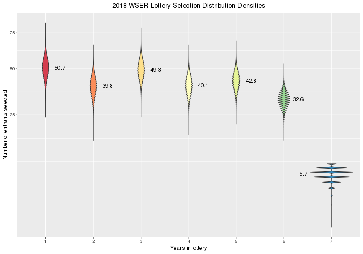

Load packages.


```r
library(parallel)
library(doParallel)
library(data.table)
library(reshape2)
library(ggplot2)
library(xtable)
library(knitr)
library(rmarkdown)
```

Parameters to update.

Applicants | Tickets | *Chance of getting drawn*
-----------|---------|--------------------------
   2       | 64      | 80.203%
  30       | 32      | 55.581%
 111       | 16      | 33.345%
 253       |  8      | 18.358%
 393       |  4      |  9.649%
1002       |  2      |  4.940%
2468       |  1      |  2.502%


```r
distn <- c(2468, 1002, 393, 253, 111, 30, 2)  # Number of entrants for each ticket count
probWSER <- c(2.502, 4.940, 9.649, 18.358, 33.345, 55.581, 80.203)  # Selection probabilities from WSER
spots <- 250  # Number of spots up for grabs
size <- 1E5  # Use 1E5 for production, 1E3 for testing
dateLottery <- as.Date("2016-12-03", format="%Y-%m-%d")  # Random number seed; use lottery date
```

# Simulation

Here, I run a simulation of the lottery process to estimate probabilities of
winning a slot for the Western States Endurance Run. The simulation does a few
things

* Use the `sample` function in R to sample without replacement using the
  number of tickets each entrant has divided by the total number of tickets in
  the *hat* as each entrant's selection probability for a single draw
* Select draws from the *hat* equal to the number of spots available
* Repeat each *lottery* a number of times
* Use the `aggregate` function to summarize the simulations and derive an
  emperical distribution of selection probabilities
* Plot the selection probability distributions

## Set up initial conditions

Here is the code to set up the lottery hat data frame at the initial state.
Print out some validation output just to make sure the initial state is set up
correctly.


```r
applicants <- sum(distn)
runner <- seq(1, applicants)
confail <- c(rep(6, distn[7]),
             rep(5, distn[6]),
             rep(4, distn[5]),
             rep(3, distn[4]),
             rep(2, distn[3]),
             rep(1, distn[2]),
             rep(0, distn[1]))
tickets <- 2^confail
frameHat <- data.frame(runner, confail, tickets)
frameHat$prob <- frameHat$tickets / sum(frameHat$tickets)
addmargins(table(factor(frameHat$tickets)))  # Check for match with `distn` vector
```

```
## 
##    1    2    4    8   16   32   64  Sum 
## 2468 1002  393  253  111   30    2 4259
```

```r
aggregate(prob ~ tickets, frameHat, mean)  # Check success probabilities of an individual draw
```

```
##   tickets          prob
## 1       1 0.00009147457
## 2       2 0.00018294914
## 3       4 0.00036589828
## 4       8 0.00073179656
## 5      16 0.00146359312
## 6      32 0.00292718624
## 7      64 0.00585437248
```

## Simulate lottery

The simulation needs to account for the changing relative distribution of
tickets after a person is selected and their tickets are no longer in the pool
of eligible tickets.

The matrix `lottery` is an $I \times J$ matrix where row $i$ is the $i$-th
simulation and the column $j$ is the $j$-th lottery winner drawn. The number
of columns in the matrix is 250, variable `spots`. The number of
simulated lotteries is variable `size`. Set the random number seed as the date
of the lottery in numeric form multipied by the number of applicants.


```r
set.seed(as.numeric(dateLottery) * applicants)
library(parallel, quietly=TRUE)
library(doParallel, quietly=TRUE)
cores <- min(detectCores(), 4)
cl <- makeCluster(cores)
registerDoParallel(cl)
simTime <- system.time(
  lottery <- foreach (i=1:size, .combine=rbind) %dopar% {
    sample(frameHat$runner, spots, prob=frameHat$prob)
  }
)
stopCluster(cl)
```

## One simulated lottery


```r
i <- sample(seq(1, size), 1)
sampLottery <- list(i, sort(lottery[i, ]))
names(sampLottery) <- c("lottery", "runner")
sampLottery
```

```
## $lottery
## [1] 66534
## 
## $runner
##   [1]    1    2    6    8    9   10   11   13   16   20   22   25   26   28
##  [15]   29   31   32   41   43   46   47   48   51   53   56   57   61   63
##  [29]   66   72   73   78   81   88   89   92  100  101  104  108  110  113
##  [43]  119  126  129  131  133  135  138  139  140  141  147  151  152  153
##  [57]  164  165  167  169  172  173  174  175  193  198  204  216  223  229
##  [71]  233  235  248  250  257  259  264  268  271  272  278  289  298  300
##  [85]  304  305  312  321  323  336  341  344  345  350  351  353  357  368
##  [99]  369  379  380  390  391  394  395  414  424  445  448  458  479  482
## [113]  493  505  517  518  533  535  536  550  573  607  649  656  663  673
## [127]  688  701  714  721  725  735  745  750  775  778  785  799  805  807
## [141]  863  908  944  948  956  959  960 1024 1035 1062 1063 1082 1102 1172
## [155] 1195 1222 1232 1236 1247 1268 1283 1300 1304 1337 1338 1344 1354 1357
## [169] 1362 1382 1392 1394 1403 1415 1429 1457 1488 1549 1562 1580 1605 1607
## [183] 1608 1642 1644 1666 1671 1676 1678 1709 1745 1751 1763 1771 1773 1818
## [197] 1849 1986 2001 2070 2082 2140 2181 2193 2194 2246 2264 2320 2422 2508
## [211] 2551 2609 2646 2762 2785 2833 2877 2884 2890 2892 3000 3055 3100 3146
## [225] 3156 3284 3423 3465 3495 3522 3560 3579 3583 3624 3697 3717 3765 3797
## [239] 3811 3882 3887 3891 3892 3917 3972 3984 4060 4113 4179 4180
```

Here's the distribution of the category of ticket holders from that random
simulated lottery.
I.e., in simulated lottery 66534, 


```r
agg1 <- data.frame(addmargins(table(frameHat$confail[sampLottery$runner])))
agg1$year <- as.numeric(agg1$Var1)
agg1$tickets <- 2 ^ agg1$year
agg1[agg1$Var1 == "Sum", ]$year <- NA
agg1[agg1$Var1 == "Sum", ]$tickets <- NA
agg1 <- agg1[, c("year", "tickets", "Freq")]
print(xtable(agg1, digits = c(0, 0, 0, 0)), type = "html", include.rownames = FALSE)
```

<!-- html table generated in R 3.3.1 by xtable 1.8-2 package -->
<!-- Tue Nov 22 13:33:26 2016 -->
<table border=1>
<tr> <th> year </th> <th> tickets </th> <th> Freq </th>  </tr>
  <tr> <td align="right"> 1 </td> <td align="right"> 2 </td> <td align="right"> 55 </td> </tr>
  <tr> <td align="right"> 2 </td> <td align="right"> 4 </td> <td align="right"> 58 </td> </tr>
  <tr> <td align="right"> 3 </td> <td align="right"> 8 </td> <td align="right"> 32 </td> </tr>
  <tr> <td align="right"> 4 </td> <td align="right"> 16 </td> <td align="right"> 53 </td> </tr>
  <tr> <td align="right"> 5 </td> <td align="right"> 32 </td> <td align="right"> 35 </td> </tr>
  <tr> <td align="right"> 6 </td> <td align="right"> 64 </td> <td align="right"> 15 </td> </tr>
  <tr> <td align="right"> 7 </td> <td align="right"> 128 </td> <td align="right"> 2 </td> </tr>
  <tr> <td align="right">  </td> <td align="right">  </td> <td align="right"> 250 </td> </tr>
   </table>

Okay... but what happened with the other 99999 simulated lotteries?

## Format lottery simulation data

I'm not really interested in which runners were selected in the lottery
simulation. What I'm really after are estimates for the probability of
selecting a runner, among the 250 available spots, with $X$ tickets in
the initial hat.

To get at this, first I'll have to match the runners selected to the number of
tickets they started out with.


```r
cl <- makeCluster(cores)
registerDoParallel(cl)
lottery2 <- foreach (i=1:size, .combine=rbind) %dopar% {
  frameHat$confail[lottery[i, ]]
}
stopCluster(cl)
```

Reformat the `lottery2` matrix to an aggregated data frame for analysis.


```r
confail <- factor(as.vector(t(lottery2)))
sim <- rep(seq(1, size), each=spots)
frameLottery <- data.frame(sim, confail)
library(data.table, quietly=TRUE)
frameLottery <- data.table(frameLottery)
aggTime <- system.time(
  aggLottery <- frameLottery[,
                             list(confail.0 = sum(confail == 0),
                                  confail.1 = sum(confail == 1),
                                  confail.2 = sum(confail == 2),
                                  confail.3 = sum(confail == 3),
                                  confail.4 = sum(confail == 4),
                                  confail.5 = sum(confail == 5),
                                  confail.6 = sum(confail == 6)),
                             sim]
)
nlev <- nlevels(frameLottery$confail)
sim <- rep(seq(1, size), each=nlev)
confail <- factor(rep(seq(1, nlev), size))
freq <- as.vector(t(aggLottery[, list(confail.0, 
                                      confail.1, 
                                      confail.2, 
                                      confail.3, 
                                      confail.4, 
                                      confail.5, 
                                      confail.6)]))
frameSummary <- data.frame(sim, confail, freq)
frameSummary <- melt(aggLottery, id.vars=c("sim"))
frameSummary$confail <- factor(gsub("confail\\.", "", frameSummary$variable))
frameSummary$freq <- frameSummary$value
frameSummary[, c("variable", "value")] <- NULL
frameSummary <- frameSummary[order(frameSummary$sim, frameSummary$confail)]
```

Save the aggregated data frame for other analysis.


```r
save(aggLottery, file="aggLottery.RData")
```

For each type of lottery applicant (1 ticket, 2 tickets, etc.), calculate the
proportion of selected applicants.


```r
total <- rep(distn, size)
frameSummary$prob <- 100 * (frameSummary$freq / total)
aggFx <- function(x) {c(mean = mean(x), median = median(x), sd = sd(x))}
aggProb <- aggregate(prob ~ confail, frameSummary, aggFx)
ev <- distn * aggProb[, "prob"][, "mean"] / 100
evWSER <- distn * probWSER / 100
diffprob <- aggProb[, "prob"][, "mean"] - probWSER
diffev <- ev - evWSER
pctdiff <- 100 * diffprob / aggProb[, "prob"][, "mean"]
sqerr <- diffprob ^2
simsum <- data.frame(confail = aggProb[, "confail"], 
                     nTickets = 2 ^ (as.numeric(aggProb[, "confail"]) - 1),
                     distn, 
                     mean = aggProb[, "prob"][, "mean"], 
                     ev, 
                     probWSER, 
                     evWSER, 
                     diffprob, 
                     diffev, 
                     pctdiff, 
                     sqerr)
names(simsum) <- c("Consec. Failures", 
                   "Number of tickets",
                   "N", 
                   "Mean", 
                   "EV", 
                   "Prob (WSER)", 
                   "EV (WSER)", 
                   "Diff. prob.", 
                   "Diff. EV", 
                   "% diff.", 
                   "Sq. error")
```

# Summarize lottery simulations

Plot the distribution of probabilities from the 100,000
simulated lotteries.

## Probability of selection


```r
title <- sprintf("%.0d WSER Lottery Selection Probability Densities", as.numeric(format(dateLottery, "%Y")) + 1)
xlab <- "Probability of selection"
options(scipen=999)
ylab <- paste("Proportion of", format(size, big.mark=",", digits=0), "simulations")
filllab <- "Consecutive failures"
annolab <- sprintf("%.2f%%", simsum$Mean)
y0 <- max(density(frameSummary$prob[frameSummary$confail == 0])$y)
y1 <- max(density(frameSummary$prob[frameSummary$confail == 1])$y)
y2 <- max(density(frameSummary$prob[frameSummary$confail == 2])$y)
y3 <- max(density(frameSummary$prob[frameSummary$confail == 3])$y)
y4 <- max(density(frameSummary$prob[frameSummary$confail == 4])$y)
y5 <- max(density(frameSummary$prob[frameSummary$confail == 5])$y)
y6 <- max(density(frameSummary$prob[frameSummary$confail == 6])$y)
y <- c(y0, y1, y2, y3, y4, y5, y6)
library(ggplot2, quietly=TRUE)
ggplot(frameSummary, aes(x=prob, y=..density.., fill=confail)) +
  geom_density(alpha=1/2, color=NA) +
  scale_fill_brewer(palette="Spectral") +
  labs(title=title, x=xlab, y=ylab, fill=filllab) +
  annotate("text", label=annolab, x=simsum$Mean, y=y) +
  theme_bw() +
  theme(legend.position="bottom")
```


As expected, the spread of the selection probabilities increases as the number
of tickets a person has in the hat increases (the variance of a binomial
random variable increases with $p$).

## Number of entrants

Another way to think about the lottery is to plot the distribution of the
frequency of runners selected by number of tickets.


```r
title <- sprintf("%.0d WSER Lottery Selection Distribution Densities", as.numeric(format(dateLottery, "%Y")) + 1)
xlab <- "Number of entrants selected"
ylab <- paste("Proportion of", format(size, big.mark=",", digits=0), "simulations")
filllab <- "Consecutive failures"
annolab <- sprintf("%.1f", simsum$EV)
y0 <- max(density(frameSummary$freq[frameSummary$confail == 0])$y)
y1 <- max(density(frameSummary$freq[frameSummary$confail == 1])$y)
y2 <- max(density(frameSummary$freq[frameSummary$confail == 2])$y)
y3 <- max(density(frameSummary$freq[frameSummary$confail == 3])$y)
y4 <- max(density(frameSummary$freq[frameSummary$confail == 4])$y)
y5 <- max(density(frameSummary$freq[frameSummary$confail == 5])$y)
y6 <- max(density(frameSummary$freq[frameSummary$confail == 6])$y)
y <- c(y0, y1, y2, y3, y4, y5, y6)
ggplot(frameSummary, aes(x=freq, y=..density.., fill=confail)) +
  geom_density(alpha=1/2, color=NA) +
  scale_fill_brewer(palette="Spectral") +
  labs(title=title, x=xlab, y=ylab, fill=filllab) +
  annotate("text", label=annolab, x=simsum$EV, y=y) +
  theme_bw() +
  theme(legend.position="bottom")
```



## Probability of selection and expected number of entrants

Compare to probabilities given in the WSER 2014 [lottery statistics](http://www.wser.org/2013/11/27/2014-lottery-statistics/).


```r
kable(simsum[, c("Number of tickets", "N", "Mean", "EV")])
```


| Number of tickets|    N|      Mean|       EV|
|-----------------:|----:|---------:|--------:|
|                 1| 2468|  2.492948| 61.52597|
|                 2| 1002|  4.922476| 49.32321|
|                 4|  393|  9.606448| 37.75334|
|                 8|  253| 18.291751| 46.27813|
|                16|  111| 33.233955| 36.88969|
|                32|   30| 55.422200| 16.62666|
|                64|    2| 80.150000|  1.60300|

My estimates are *virtually identical* to the probabilities calculated by
[WSER](http://www.wser.org/2013/11/27/2014-lottery-statistics) (*Mean* column
versus the *Prob (WSER)* column). Percent differences of the selection
probabilities are never more than 0.4429542% and the mean
squared error of the selection probabilities is 0.006707.


# Outcome of sample of lotteries

Estimated from 100,000 simulated lotteries.

## Sample of simulated lotteries


```r
s <- 25
title <- sprintf("Simulated %.0d WSER Lotteries\nSample of %.0f Lotteries", as.numeric(format(dateLottery, "%Y")) + 1, s)
xlab <- "Simulated lottery"
ylab <- "Number of selected runners\nEach block represents 10 runners"
filllab <- "Consecutive failures"
i <- sample(seq(1, size), s)
frameSample <- frameLottery[frameLottery$sim %in% i, ]
frameSample$sim <- factor(frameSample$sim)
levels(frameSample$sim) <- rev(levels(frameSample$sim))
ggplot(frameSample, aes(x=sim, fill=confail)) +
  geom_bar(width=1) +
  geom_hline(yintercept = seq(0, spots, 10), color="white") +
  geom_vline(xintercept = seq(1, s)-0.5, color="white") +
  scale_fill_brewer(palette="Spectral") +
  scale_y_continuous(expand=c(0, 0)) +
  labs(title=title, x=xlab, y=ylab, fill=filllab) +
  coord_flip() +
  theme_bw() +
  theme(legend.position="top")
```


## Most likely scenarios


```r
scenarios <- aggLottery[, .N, list(confail.0, 
                                   confail.1, 
                                   confail.2, 
                                   confail.3, 
                                   confail.4, 
                                   confail.5, 
                                   confail.6)]
scenarios <- scenarios[, prop := N / size]
mostLikely <- scenarios[N == max(scenarios[, N])]
setnames(mostLikely, names(mostLikely), c(2 ^ seq(0, nlev - 1), "N", "Prop."))
print(xtable(mostLikely, digits=c(rep(0, 9), 5)), type="html", include.rownames=FALSE)
```

<!-- html table generated in R 3.3.1 by xtable 1.8-2 package -->
<!-- Tue Nov 22 13:37:10 2016 -->
<table border=1>
<tr> <th> 1 </th> <th> 2 </th> <th> 4 </th> <th> 8 </th> <th> 16 </th> <th> 32 </th> <th> 64 </th> <th> N </th> <th> Prop. </th>  </tr>
  <tr> <td align="right"> 57 </td> <td align="right"> 50 </td> <td align="right"> 37 </td> <td align="right"> 47 </td> <td align="right"> 42 </td> <td align="right"> 15 </td> <td align="right"> 2 </td> <td align="right"> 4 </td> <td align="right"> 0.00004 </td> </tr>
  <tr> <td align="right"> 59 </td> <td align="right"> 47 </td> <td align="right"> 39 </td> <td align="right"> 46 </td> <td align="right"> 41 </td> <td align="right"> 16 </td> <td align="right"> 2 </td> <td align="right"> 4 </td> <td align="right"> 0.00004 </td> </tr>
  <tr> <td align="right"> 61 </td> <td align="right"> 47 </td> <td align="right"> 39 </td> <td align="right"> 50 </td> <td align="right"> 35 </td> <td align="right"> 17 </td> <td align="right"> 1 </td> <td align="right"> 4 </td> <td align="right"> 0.00004 </td> </tr>
   </table>

# Actual results

The actual lottery was held on December 7, 2012. Here are the results, from
the Western States Endurance Run [Facebook post](https://www.facebook.com/permalink.php?story_fbid=10152053026305412&id=293403870411),

> Congratulations to all those chosen in the lottery today. Here are some
> stats for the ticket groups of the 270 selected (and predicted by our MC
> simulations)  
> one ticket - 101 selected (112 predicted))  
> two tickets - 78 (70)  
> three tickets - 45 (47)  
> four tickets -27 (25)  
> five tickets - 19 (15)  

Compare the observed lottery to the expected lottery.


```r
yObs <- c(101, 78, 45, 27, 19)
yExp <- simsum$EV
frameObsExp <- data.frame(yObs, yExp, diff=yObs - yExp)
names(frameObsExp) <- c("Observed", "Expected", "Difference")
print(xtable(frameObsExp), type="html", include.rownames=FALSE)
```

I wonder how many times this outcome appeared in my simulated lotteries?


```r
y1 <- aggLottery$confail[,1] == yObs[1]
y2 <- aggLottery$confail[,2] == yObs[2]
y3 <- aggLottery$confail[,3] == yObs[3]
y4 <- aggLottery$confail[,4] == yObs[4]
y5 <- aggLottery$confail[,5] == yObs[5]
y <- y1 & y2 & y3 & y4 & y5
aggLottery[y,]
```

Of the 100,000 simulated lotteries, only 5.6811328, or
0.00568%, matched the exact outcome of the
actual lottery.


# Details

Go to my [WSERLottery](https://github.com/benjamin-chan/WSERLottery) repository for the gory details.


# Session info


```
## Timestamp: 2016-11-22 13:37:10
```

```
## Number of cores used in simulation: 4
```

```
## Random number seed: 72990742
```

```
## Elapsed time of simulation: 2.886 minutes
```

```
## Elapsed time of aggregation: 0.441 minutes
```

```
## R version 3.3.1 (2016-06-21)
## Platform: x86_64-w64-mingw32/x64 (64-bit)
## Running under: Windows 7 x64 (build 7601) Service Pack 1
## 
## attached base packages:
## [1] parallel  stats     graphics  grDevices utils     datasets  methods  
## [8] base     
## 
## other attached packages:
##  [1] knitr_1.14          xtable_1.8-2        ggplot2_2.1.0      
##  [4] reshape2_1.4.1      doParallel_1.0.10   iterators_1.0.8    
##  [7] foreach_1.4.3       rmarkdown_1.0       data.table_1.9.6   
## [10] checkpoint_0.3.16   RevoUtilsMath_8.0.3
## 
## loaded via a namespace (and not attached):
##  [1] Rcpp_0.12.7        magrittr_1.5       munsell_0.4.3     
##  [4] colorspace_1.2-7   highr_0.6          stringr_1.1.0     
##  [7] plyr_1.8.4         tools_3.3.1        grid_3.3.1        
## [10] gtable_0.2.0       htmltools_0.3.5    yaml_2.1.13       
## [13] digest_0.6.10      RColorBrewer_1.1-2 formatR_1.4       
## [16] codetools_0.2-15   evaluate_0.9       labeling_0.3      
## [19] stringi_1.1.1      compiler_3.3.1     RevoUtils_10.0.1  
## [22] scales_0.4.0       chron_2.3-47
```

```
##                      sysname                      release 
##                    "Windows"                      "7 x64" 
##                      version                     nodename 
## "build 7601, Service Pack 1"                    "GHBA402" 
##                      machine                        login 
##                     "x86-64"                      "chanb" 
##                         user               effective_user 
##                      "chanb"                      "chanb"
```
