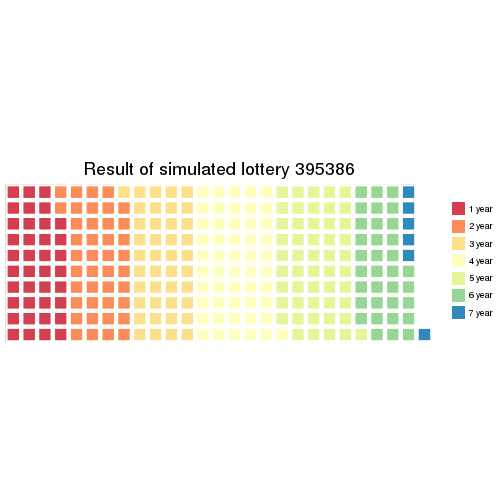
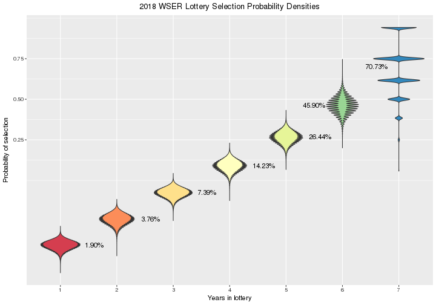

# 2018 Western States Endurance Run Lottery

Load packages.


```r
library(parallel)
library(doParallel)
```

```
## Loading required package: foreach
```

```
## Loading required package: iterators
```

```r
library(data.table)
library(reshape2)
```

```
## 
## Attaching package: 'reshape2'
```

```
## The following objects are masked from 'package:data.table':
## 
##     dcast, melt
```

```r
library(ggplot2)
library(RColorBrewer)
library(waffle)
library(xtable)
library(knitr)
library(rmarkdown)
```

Parameters to update.
Source: [2018 WSER Lottery Entrants](http://www.wser.org/lottery2018.html).

> Total Tickets: 15084     Total Entrants: 4916
> 
> Last Updated: 11-26-2017 20:26:49 PST
> 
> Years (Tickets) | Entrants| Tickets
> :--------------:|:-------:|:------:
> 7 (64) |    8 |  512
> 6 (32) |   71 | 2272
> 5 (16) |  162 | 2592
> 4 (8)  |  282 | 2256
> 3 (4)  |  667 | 2668
> 2 (2)  | 1058 | 2116
> 1 (1)  | 2668 | 2668


```r
size <- 5E5  # Use 1E5 for production, 1E3 for testing
distn <- c(2668, 1058, 667, 282, 162, 71, 8)  # Number of entrants for each ticket count
spots <- 261  # Number of spots up for grabs
dateLottery <- as.Date("2017-12-02", format="%Y-%m-%d")  # Random number seed; use lottery date
```

# Simulation

Here, I run a simulation of the lottery process to estimate probabilities of
winning a slot for the Western States Endurance Run. The simulation does a few
things

* Use the `sample` function in R to sample without replacement using the
  number of tickets each entrant has divided by the total number of tickets in
  the *hat* as each entrant's selection probability for a single draw
* Select draws from the *hat* equal to the number of spots available
* Repeat each *lottery* a number of times
* Use the `aggregate` function to summarize the simulations and derive an
  emperical distribution of selection probabilities
* Plot the selection probability distributions

## Set up initial conditions

Here is the code to set up the lottery hat data frame at the initial state.
Print out some validation output just to make sure the initial state is set up
correctly.


```r
applicants <- sum(distn)
runner <- seq(1, applicants)
year <- rep(1:7, times = distn)
tickets <- 2^(year - 1)
frameHat <- data.frame(runner, year, tickets)
frameHat$prob <- frameHat$tickets / sum(frameHat$tickets)
addmargins(table(factor(frameHat$tickets)))  # Check for match with `distn` vector
```

```
## 
##    1    2    4    8   16   32   64  Sum 
## 2668 1058  667  282  162   71    8 4916
```

```r
kable(aggregate(prob ~ tickets, frameHat, mean))  # Check success probabilities of an individual draw
```


| tickets|      prob|
|-------:|---------:|
|       1| 0.0000663|
|       2| 0.0001326|
|       4| 0.0002652|
|       8| 0.0005304|
|      16| 0.0010607|
|      32| 0.0021215|
|      64| 0.0042429|

## Simulate lottery

The simulation needs to account for the changing relative distribution of
tickets after a person is selected and their tickets are no longer in the pool
of eligible tickets.

The matrix `lottery` is an $I \times J$ matrix where row $i$ is the $i$-th
simulation and the column $j$ is the $j$-th lottery winner drawn. The number
of columns in the matrix is 261, variable `spots`. The number of
simulated lotteries is variable `size`. Set the random number seed as the date
of the lottery in numeric form multipied by the number of applicants.


```r
set.seed(as.numeric(dateLottery) * applicants)
cores <- detectCores()
cl <- makeCluster(cores)
registerDoParallel(cl)
simTime <- system.time(
  lottery <- foreach (i=1:size, .combine=rbind) %dopar% {
    sample(frameHat$runner, spots, prob=frameHat$prob)
  }
)
stopCluster(cl)
```

## One simulated lottery


```r
i <- sample(seq(1, size), 1)
```

Here's the distribution of the category of ticket holders from that random
simulated lottery.
I.e., in simulated lottery 395386, 


```r
sampLottery <- list(i, sort(lottery[i, ]))
names(sampLottery) <- c("lottery", "runner")
agg1 <- data.frame(addmargins(table(frameHat$year[sampLottery$runner])))
agg1$year <- as.numeric(agg1$Var1)
agg1$tickets <- 2 ^ (agg1$year - 1)
agg1[agg1$Var1 == "Sum", ]$year <- NA
agg1[agg1$Var1 == "Sum", ]$tickets <- NA
agg1 <- agg1[, c("year", "tickets", "Freq")]
freq <- agg1[!is.na(agg1$year), "Freq"]
names(freq) <- sprintf("%d year", agg1[!is.na(agg1$year), "year"])
waffle(freq, 
       title = sprintf("Result of simulated lottery %d", i),
       colors = brewer.pal(length(freq), "Spectral")) +
  theme(plot.title = element_text(hjust = 0.5))
```



Okay... but what happened with the other 4.99999 &times; 10<sup>5</sup> simulated lotteries?


## Format lottery simulation data

I'm not really interested in which runners were selected in the lottery
simulation. What I'm really after are estimates for the probability of
selecting a runner, among the 261 available spots, with $X$ tickets in
the initial hat.

To get at this, first I'll have to match the runners selected to the number of
tickets they started out with.


```r
cl <- makeCluster(cores)
registerDoParallel(cl)
lottery2 <- foreach (i=1:size, .combine=rbind) %dopar% {
  frameHat$year[lottery[i, ]]
}
stopCluster(cl)
```

Reformat the `lottery2` matrix to an aggregated data frame for analysis.


```r
year <- factor(as.vector(t(lottery2)))
sim <- rep(seq(1, size), each=spots)
frameLottery <- data.table(sim, year)
aggTime <- system.time(
  aggLottery <- frameLottery[,
                             list(year1 = sum(year == 1),
                                  year2 = sum(year == 2),
                                  year3 = sum(year == 3),
                                  year4 = sum(year == 4),
                                  year5 = sum(year == 5),
                                  year6 = sum(year == 6),
                                  year7 = sum(year == 7)),
                             sim]
)
nlev <- nlevels(frameLottery$year)
sim <- rep(seq(1, size), each=nlev)
year <- factor(rep(seq(1, nlev), size))
freq <- as.vector(t(aggLottery[, list(year1, 
                                      year2, 
                                      year3, 
                                      year4, 
                                      year5, 
                                      year6, 
                                      year7)]))
frameSummary <- data.frame(sim, year, freq)
frameSummary <- melt(aggLottery, id.vars=c("sim"))
frameSummary$year <- factor(gsub("year", "", frameSummary$variable))
frameSummary$freq <- frameSummary$value
frameSummary[, c("variable", "value")] <- NULL
frameSummary <- frameSummary[order(frameSummary$sim, frameSummary$year)]
```

Save the aggregated data frame for other analysis.


```r
save(aggLottery, file="aggLottery.RData")
```

For each type of lottery applicant (1 ticket, 2 tickets, etc.), calculate the
proportion of selected applicants.


```r
total <- rep(distn, size)
frameSummary$prob <- 100 * (frameSummary$freq / total)
aggFx <- function(x) {c(mean = mean(x), median = median(x), sd = sd(x))}
aggProb <- aggregate(prob ~ year, frameSummary, aggFx)
ev <- distn * aggProb[, "prob"][, "mean"] / 100
simsum <- data.frame(year = aggProb[, "year"], 
                     nTickets = 2 ^ (as.numeric(aggProb[, "year"]) - 1),
                     distn, 
                     mean = aggProb[, "prob"][, "mean"], 
                     ev)
names(simsum) <- c("Years in lottery", 
                   "Number of tickets",
                   "N", 
                   "Mean probability of selection", 
                   "Expected value")
```


## Outcome of sample of lotteries

Sample of 5e+05 simulated lotteries.


```r
s <- 20
title <- sprintf("Simulated %.0d WSER Lotteries\nSample of %.0f Lotteries", as.numeric(format(dateLottery, "%Y")) + 1, s)
xlab <- "Simulated lottery"
ylab <- "Number of selected runners\nEach block represents 10 runners"
filllab <- "Years in lottery"
i <- sample(seq(1, size), s)
frameSample <- frameLottery[frameLottery$sim %in% i, ]
frameSample$sim <- factor(frameSample$sim)
levels(frameSample$sim) <- rev(levels(frameSample$sim))
ggplot(frameSample, aes(x=sim, fill=year)) +
  geom_bar(width=1) +
  geom_hline(yintercept = seq(0, spots, 10), color="white") +
  geom_vline(xintercept = seq(1, s)-0.5, color="white") +
  scale_fill_brewer(palette="Spectral") +
  scale_y_continuous(expand=c(0, 0)) +
  labs(title=title, x=xlab, y=ylab, fill=filllab) +
  coord_flip() +
  theme_bw() +
  theme(legend.position="top",
        plot.title = element_text(hjust = 0.5))
```


# Summarize lottery simulations

Plot the distribution of probabilities from the 5e+05
simulated lotteries.

## Probability of selection


```r
title <- sprintf("%.0d WSER Lottery Selection Probability Densities", as.numeric(format(dateLottery, "%Y")) + 1)
xlab <- "Probability of selection"
options(scipen=999)
ylab <- paste("Proportion of", format(size, big.mark=",", digits=0), "simulations")
filllab <- "Years in lottery"
annolab <- sprintf("%.2f%%", simsum$"Mean probability of selection")
y1 <- max(density(frameSummary$prob[frameSummary$year == 1])$y)
y2 <- max(density(frameSummary$prob[frameSummary$year == 2])$y)
y3 <- max(density(frameSummary$prob[frameSummary$year == 3])$y)
y4 <- max(density(frameSummary$prob[frameSummary$year == 4])$y)
y5 <- max(density(frameSummary$prob[frameSummary$year == 5])$y)
y6 <- max(density(frameSummary$prob[frameSummary$year == 6])$y)
y7 <- max(density(frameSummary$prob[frameSummary$year == 7])$y)
y <- c(y1, y2, y3, y4, y5, y6, y7)
ggplot(frameSummary, aes(x = year, y = prob / 100, fill = year)) +
  geom_violin() +
  scale_fill_brewer(palette="Spectral") + 
  scale_y_continuous(trans = "logit") + 
  labs(title=title, x=filllab, y=xlab, fill=filllab) +
  annotate("text", label=annolab, y=simsum$"Mean probability of selection" / 100, x=c(1:5+0.6, 6-0.5, 7 - 0.4)) +
  theme(legend.position = "none",
        plot.title = element_text(hjust = 0.5))
```

```
## Warning: Transformation introduced infinite values in continuous y-axis
```

```
## Warning: Removed 30869 rows containing non-finite values (stat_ydensity).
```



As expected, the spread of the selection probabilities increases as the number
of tickets a person has in the hat increases (the variance of a binomial
random variable increases with $p$).

## Number of entrants

Another way to think about the lottery is to plot the distribution of the
frequency of runners selected by number of tickets.


```r
title <- sprintf("%.0d WSER Lottery Selection Distribution Densities", as.numeric(format(dateLottery, "%Y")) + 1)
xlab <- "Number of entrants selected"
ylab <- paste("Proportion of", format(size, big.mark=",", digits=0), "simulations")
filllab <- "Years in lottery"
annolab <- sprintf("%.1f", simsum$"Expected value")
y1 <- max(density(frameSummary$freq[frameSummary$year == 1])$y)
y2 <- max(density(frameSummary$freq[frameSummary$year == 2])$y)
y3 <- max(density(frameSummary$freq[frameSummary$year == 3])$y)
y4 <- max(density(frameSummary$freq[frameSummary$year == 4])$y)
y5 <- max(density(frameSummary$freq[frameSummary$year == 5])$y)
y6 <- max(density(frameSummary$freq[frameSummary$year == 6])$y)
y7 <- max(density(frameSummary$freq[frameSummary$year == 7])$y)
y <- c(y1, y2, y3, y4, y5, y6, y7)
ggplot(frameSummary, aes(x = year, y = freq, fill = year)) +
  geom_violin() +
  scale_fill_brewer(palette="Spectral") + 
  scale_y_sqrt() + 
  labs(title=title, x=filllab, y=xlab, fill=filllab) +
  annotate("text", label=annolab, y=simsum$"Expected value", x=c(1:6+0.3, 7-0.6)) +
  theme(legend.position = "none",
        plot.title = element_text(hjust = 0.5))
```


## Probability all 64-ticket holders are selected


```r
df <- aggregate(sim ~ freq, frameSummary[year == nlev, ], length)
nsim <- df[df$freq == max(df$freq), "sim"]
```

The probability all 64-ticket holders are selected is 
6.17%.


# Session info


```
## Timestamp: 2017-11-29 09:47:40
```

```
## Number of cores used in simulation: 24
```

```
## Random number seed: 86039832
```

```
## Elapsed time of simulation: 100.954 minutes
```

```
## Elapsed time of aggregation: 6.466 minutes
```

```
## R version 3.4.1 (2017-06-30)
## Platform: x86_64-redhat-linux-gnu (64-bit)
## Running under: CentOS Linux 7 (Core)
## 
## Matrix products: default
## BLAS/LAPACK: /usr/lib64/R/lib/libRblas.so
## 
## attached base packages:
## [1] parallel  stats     graphics  grDevices utils     datasets  base     
## 
## other attached packages:
##  [1] xtable_1.8-2        waffle_0.7.0        RColorBrewer_1.1-2 
##  [4] ggplot2_2.2.1       reshape2_1.4.2      data.table_1.10.4-3
##  [7] doParallel_1.0.11   iterators_1.0.8     foreach_1.4.3      
## [10] rmarkdown_1.6       knitr_1.17          checkpoint_0.4.2   
## 
## loaded via a namespace (and not attached):
##  [1] Rcpp_0.12.13     Rttf2pt1_1.3.4   magrittr_1.5     munsell_0.4.3   
##  [5] colorspace_1.3-2 rlang_0.1.2      highr_0.6        stringr_1.2.0   
##  [9] plyr_1.8.4       tools_3.4.1      grid_3.4.1       gtable_0.2.0    
## [13] extrafontdb_1.0  htmltools_0.3.6  lazyeval_0.2.1   rprojroot_1.2   
## [17] digest_0.6.12    tibble_1.3.4     gridExtra_2.3    codetools_0.2-15
## [21] evaluate_0.10.1  labeling_0.3     stringi_1.1.5    compiler_3.4.1  
## [25] methods_3.4.1    scales_0.5.0     backports_1.1.1  extrafont_0.17
```

```
##                               sysname 
##                               "Linux" 
##                               release 
##          "3.10.0-514.16.1.el7.x86_64" 
##                               version 
## "#1 SMP Wed Apr 12 15:04:24 UTC 2017" 
##                              nodename 
##                  "exanode-2-23.local" 
##                               machine 
##                              "x86_64" 
##                                 login 
##                             "unknown" 
##                                  user 
##                               "chanb" 
##                        effective_user 
##                               "chanb"
```
