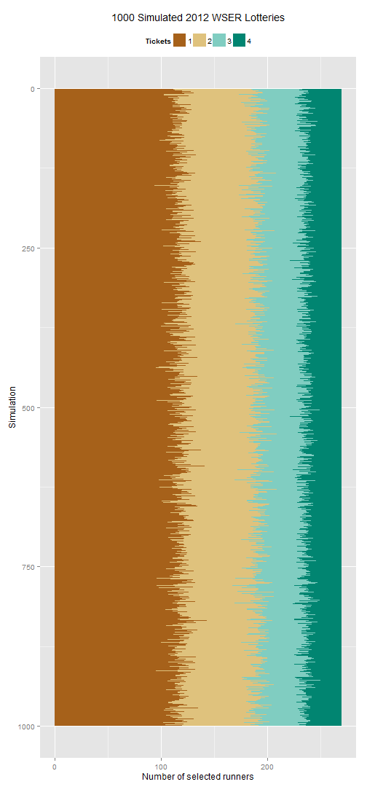

Western States Endurance Run Lottery
====================================
I was a little intrigued by how the Western States Endurance Run (WSER) calculated their lottery odds estimates. Their estimates can be found on the [WSER website](http://www.wser.org/2012/12/03/dec-8-lottery-details).

> As posted on the lottery applicant page, we have 2302 total lottery applicants for the 2013 race.
>
> 122 applicants with four tickets = 488 tickets
>
> 207 applicants with three tickets = 621 tickets
>
> 482 applicants with two tickets = 964 tickets
>
> 1491 applicants with one ticket = 1491 tickets
>
> Total tickets in the hat = 3564
>
> We are going to draw 270 unique names in the lottery and then an additional five from the lottery within the lottery. That is, the folks in the audience who have not been selected up to that point. Based on 3564 total tickets and 270 names drawn, the odds of getting selected have been calculated as follows:
>
> one ticket odds = 7.6%
>
> two ticket odds = 14.6%
>
> three ticket odds = 21.1%
>
> four ticket odds = 27.1%
>
> $E(X) = \sum X P(X)$. What this is saying (in English) is "The expected value is the sum of all the gains multiplied by their individual probabilities."

First, what are labeled as *odds* appears to really be *probabilities*. Second, the sum of those probabilities do not add up to 1.

At first, I suspected the reason might be the automatic spots. But the text of the lottery process above is clear that the 270 runners that will be drawn will be solely from the lottery applicants and will not include the automatic spots.

Here, I run a simulation of the lottery process to estimate probabilities of winning a slot for the Western States Endurance Run. The simulation accounts for the changing probability distribution of the lottery hat as runners are selected. Once a runner is selected, their tickets are withdrawn from the hat.

I'll use `R version 2.15.2 (2012-10-26)`. This code was run on `2012-12-04 12:16:59`.

Load the required packages.

```r
require(xtable, quietly = TRUE)
require(ggplot2, quietly = TRUE)
```


Setting up the initial condition
--------------------------------
Here is the code to set up the lottery hat data frame at the initial state. Print out some validation output just to make sure the initial state is set up correctly.

```r
applicants <- 2302
spots <- 270
runner <- seq(1, applicants)
n <- c(1491, 482, 207, 122)
tickets <- c(rep(4, n[4]), rep(3, n[3]), rep(2, n[2]), rep(1, n[1]))
dfHat0 <- data.frame(runner, tickets)
dfHat0$prob <- dfHat0$tickets/sum(dfHat0$tickets)
table(factor(dfHat0$tickets))
```

```
## 
##    1    2    3    4 
## 1491  482  207  122
```

```r
head(dfHat0)
```

```
##   runner tickets     prob
## 1      1       4 0.001122
## 2      2       4 0.001122
## 3      3       4 0.001122
## 4      4       4 0.001122
## 5      5       4 0.001122
## 6      6       4 0.001122
```

```r
tail(dfHat0)
```

```
##      runner tickets      prob
## 2297   2297       1 0.0002806
## 2298   2298       1 0.0002806
## 2299   2299       1 0.0002806
## 2300   2300       1 0.0002806
## 2301   2301       1 0.0002806
## 2302   2302       1 0.0002806
```


Simulation
----------
The simulation needs to account for the changing relative distribution of tickets after a person is selected and their tickets are no longer in the pool of eligible tickets.

The matrix `lottery` is an $I \times J$ matrix where row $i$ is the $i$-th simulation and the column $j$ is the $j$-th lottery winner drawn. The number of columns in the matrix is `270`, variable `spots`. The number of simulated lotteries is variable `size`. Set the random number seed as the date of the lottery in numeric form multipied by the number of applicants.

```r
size <- 1000
set.seed(as.numeric(as.Date("2012-12-08", format = "%Y-%m-%d")) * applicants)
lottery <- matrix(nrow = size, ncol = spots)
start <- Sys.time()
for (i in 1:size) {
    dfHat <- dfHat0
    for (j in 1:spots) {
        lottery[i, j] <- sample(dfHat$runner, 1, prob = dfHat$prob)
        dfHat <- subset(dfHat, runner != lottery[i, j])
        dfHat$prob <- dfHat$tickets/sum(dfHat$tickets)
    }
}
end <- Sys.time()
end - start
```

```
## Time difference of 2.884 mins
```


Here's an example of the selected runners drawn from a random simulated lottery.

```r
i <- sample(c(1, size), 1)
sort(lottery[i, ])
```

```
##   [1]    2    4    6   10   15   17   18   26   28   31   37   39   43   56
##  [15]   58   60   61   64   67   68   69   71   72   79   80   81   86   87
##  [29]   92   95  100  102  103  108  114  115  116  118  123  125  129  130
##  [43]  134  139  150  155  157  160  165  166  167  176  178  180  185  191
##  [57]  193  195  200  206  208  217  218  220  231  235  239  241  242  243
##  [71]  245  248  256  258  260  264  265  269  287  288  289  291  295  296
##  [85]  303  308  309  316  317  321  324  325  326  328  334  340  357  363
##  [99]  379  382  383  390  391  402  403  404  411  414  423  424  432  438
## [113]  440  446  447  467  473  482  488  492  502  507  509  514  515  519
## [127]  521  528  541  573  595  612  613  616  617  618  642  645  665  669
## [141]  680  681  696  701  703  712  717  719  720  722  725  730  732  738
## [155]  747  761  767  783  795  808  826  843  849  854  866  878  881  883
## [169]  884  896  901  921  924  925  929  938  946  969  990  994 1013 1024
## [183] 1046 1061 1068 1098 1111 1121 1148 1183 1230 1238 1269 1289 1302 1303
## [197] 1311 1336 1369 1397 1418 1420 1467 1494 1495 1529 1536 1542 1544 1571
## [211] 1577 1578 1582 1605 1608 1636 1646 1661 1670 1691 1699 1700 1712 1721
## [225] 1743 1760 1762 1778 1781 1812 1815 1816 1829 1837 1896 1905 1911 1914
## [239] 1931 1942 1943 1954 1977 2004 2021 2024 2026 2046 2047 2057 2064 2069
## [253] 2073 2092 2097 2102 2111 2136 2142 2144 2159 2170 2171 2176 2177 2231
## [267] 2265 2269 2278 2296
```


Summary
-------
I'm not really interested in which runners were selected in the lottery simulation. What I'm really after are estimates for the probability of selecting a runner, among the `270` available spots, with $X$ tickets in the initial hat.

To get at this, first I'll have to match the runners selected to the number of tickets they started out with.

```r
lottery2 <- matrix(nrow = size, ncol = spots)
for (i in 1:size) {
    lottery2[i, ] <- dfHat0$tickets[lottery[i, ]]
}
```

Reformat the `distn` matrix to an aggregated data frame for analysis.

```r
tickets <- factor(as.vector(t(lottery2)))
sim <- rep(seq(1, size), each = spots)
dfLottery <- data.frame(sim, tickets)
aggLottery <- aggregate(tickets ~ sim, dfLottery, table)
sim <- rep(seq(1, size), each = 4)
tickets <- factor(rep(seq(1, 4), size))
freq <- as.vector(t(aggLottery$tickets))
dfSummary <- data.frame(sim, tickets, freq)
```

For each type of lottery applicant (1 ticket, 2 tickets, etc.), calculate the proportion of selected applicants. Print a summary table of the mean and median selection probabilities and their standard deviations.

```r
total <- rep(n, size)
dfSummary$prob <- 100 * (dfSummary$freq/total)
avg <- aggregate(prob ~ tickets, dfSummary, mean)
med <- aggregate(prob ~ tickets, dfSummary, median)
sd <- aggregate(prob ~ tickets, dfSummary, sd)
simsum <- data.frame(avg, med[, 2], sd[, 2])
names(simsum) <- c("tickets", "mean", "median", "sd")
print(xtable(simsum), type = "html", include.rownames = FALSE)
```

<!-- html table generated in R 2.15.2 by xtable 1.7-0 package -->
<!-- Tue Dec 04 12:19:54 2012 -->
<TABLE border=1>
<TR> <TH> tickets </TH> <TH> mean </TH> <TH> median </TH> <TH> sd </TH>  </TR>
  <TR> <TD> 1 </TD> <TD align="right"> 7.90 </TD> <TD align="right"> 7.91 </TD> <TD align="right"> 0.50 </TD> </TR>
  <TR> <TD> 2 </TD> <TD align="right"> 15.14 </TD> <TD align="right"> 15.15 </TD> <TD align="right"> 1.40 </TD> </TR>
  <TR> <TD> 3 </TD> <TD align="right"> 21.77 </TD> <TD align="right"> 21.74 </TD> <TD align="right"> 2.53 </TD> </TR>
  <TR> <TD> 4 </TD> <TD align="right"> 28.05 </TD> <TD align="right"> 27.87 </TD> <TD align="right"> 3.96 </TD> </TR>
   </TABLE>

Plot the distribution of probabilities from the `1000` simulated lotteries.

```r
ggplot(dfSummary, aes(x = prob, y = ..density.., fill = tickets)) + geom_density(alpha = 1/2, 
    color = NA) + scale_fill_brewer(type = "div", palette = "BrBG") + scale_x_continuous(limits = c(0, 
    max(dfSummary$prob))) + labs(title = "2012 WSER Lottery Probability Densities", 
    x = "%", y = paste("Proportion of", size, "simulations"), fill = "Tickets") + 
    annotate("text", label = format(avg[, 2], digits = 2, trim = TRUE), x = avg[, 
        2], y = c(0.84, 0.3, 0.2, 0.13)) + theme(legend.position = "bottom")
```

 

As expected, the spread of the selection probabilities increases as the number of tickets a person has in the hat increases (the variance of a binomial random variable increases with $p$).

Plot the results of all the simulated lotteries. **Need to reorder so the relationships are easier to digest**

```r
ggplot(dfSummary, aes(x = sim, y = freq, fill = tickets)) + geom_area(stat = "identity") + 
    scale_fill_brewer(type = "div", palette = "BrBG") + scale_x_reverse() + 
    labs(title = paste(size, "Simulated 2012 WSER Lotteries"), x = "Simulation", 
        y = "Number of selected runners", fill = "Tickets") + theme(legend.position = "top") + 
    coord_flip()
```

 

