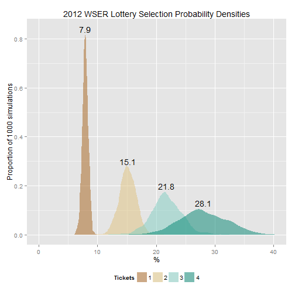
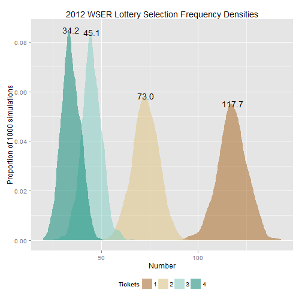
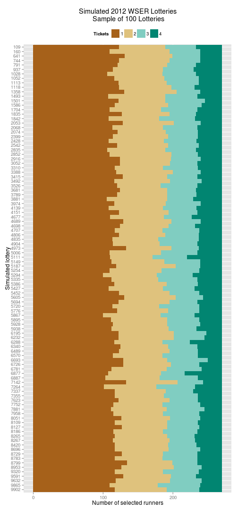

2014 Western States Endurance Run Lottery
=========================================
Last update by Benjamin Chan (<benjamin.ks.chan@gmail.com>) on 2013-12-02 09:20:49 using R version 3.0.2 (2013-09-25).


Details
-------
From the [2014 WSER lottery page](http://www.wser.org/lottery2014.html). **Use this table** for input data on the number entrants for each ticket count. The index of the vector will serve as the ticket count.

> Total Tickets: 4312     Total Entrants: 2705
>  
> Last Updated: 12/02/2013 7:00AM PST
>  
> Ticket Count | Entrants | Tickets  
> -------------|----------|--------
> 5 | 53 | 265  
> 4 | 106 | 424  
> 3 | 258 | 774  
> 2 | 561 | 1122  
> 1 | 1727 | 1727  


```r
distn <- c(1727, 561, 258, 106, 53)
```


This information is different from what is shown on the [2014 lottery statistics](http://www.wser.org/2013/11/27/2014-lottery-statistics) page.  **Use this table** for input data on the selection probabilities.
> Tickets | # of Entrants | Probability (%) | Expected # Selected | Expected % Selected  
> --------|---------------|-----------------|---------------------|--------------------
> 1 | 1749 | 6.46 | 112.9 | 41.8  
> 2 | 565 | 12.49 | 70.6 | 26.1  
> 3 | 257 | 18.16 | 46.7 | 17.3  
> 4 | 107 | 23.43 | 25.1 | 9.3  
> 5 | 52 | 28.39 | 14.8 | 5.5  
> Totals | 2730 |  | 270.0 | 100.0


```r
probWSER <- c(6.46, 12.49, 18.16, 23.43, 28.39)
```


Here, I run a simulation of the lottery process to estimate probabilities of winning a slot for the Western States Endurance Run. The simulation does a few things
* Accounts for the changing probability distribution of the lottery hat as runners are selected
* Once a runner is selected, their tickets are withdrawn from the hat
* For each simulated lottery, the distribution of selected 1-ticket, 2-ticket, 3-ticket, 4-ticket, adn 5-ticket runners is determined
* From this distributions of the simulated lotteries, the estimated selection probabilities are characterized
* Selection probability distributions are plotted
* Selection distributions from the simulated lotteries are also plotted


Set up initial conditions
-------------------------
Here is the code to set up the lottery hat data frame at the initial state. Print out some validation output just to make sure the initial state is set up correctly.

```r
spots <- 270
applicants <- sum(distn)
runner <- seq(1, applicants)
tickets <- c(rep(5, distn[5]), rep(4, distn[4]), rep(3, distn[3]), rep(2, distn[2]), 
    rep(1, distn[1]))
frameHat <- data.frame(runner, tickets)
frameHat$prob <- frameHat$tickets/sum(frameHat$tickets)
addmargins(table(factor(frameHat$tickets)))
```

```
## 
##    1    2    3    4    5  Sum 
## 1727  561  258  106   53 2705
```

```r
head(frameHat)
```

```
##   runner tickets    prob
## 1      1       5 0.00116
## 2      2       5 0.00116
## 3      3       5 0.00116
## 4      4       5 0.00116
## 5      5       5 0.00116
## 6      6       5 0.00116
```

```r
tail(frameHat)
```

```
##      runner tickets      prob
## 2700   2700       1 0.0002319
## 2701   2701       1 0.0002319
## 2702   2702       1 0.0002319
## 2703   2703       1 0.0002319
## 2704   2704       1 0.0002319
## 2705   2705       1 0.0002319
```


Simulate lottery
----------------
The simulation needs to account for the changing relative distribution of tickets after a person is selected and their tickets are no longer in the pool of eligible tickets.

The matrix `lottery` is an $I \times J$ matrix where row $i$ is the $i$-th simulation and the column $j$ is the $j$-th lottery winner drawn. The number of columns in the matrix is 270, variable `spots`. The number of simulated lotteries is variable `size`. Set the random number seed as the date of the lottery in numeric form multipied by the number of applicants.

```r
size <- 1e+05
dateLottery <- as.Date("2013-12-07", format = "%Y-%m-%d")
set.seed(as.numeric(dateLottery) * applicants)
lottery <- matrix(nrow = size, ncol = spots)
system.time(for (i in 1:size) {
    lottery[i, ] <- sample(frameHat$runner, spots, prob = frameHat$prob)
})
```

```
##    user  system elapsed 
##   80.11    0.11   80.47
```


Here's an example of the selected runners drawn from a random simulated lottery.

```r
i <- sample(seq(1, size), 1)
sampLottery <- list(i, sort(lottery[i, ]))
names(sampLottery) <- c("lottery", "runner")
sampLottery
```

```
## $lottery
## [1] 34444
## 
## $runner
##   [1]    2    4   12   13   17   27   32   37   45   48   50   52   53   55
##  [15]   64   72   73   74   91   95   99  101  117  122  123  125  136  137
##  [29]  146  151  153  166  167  169  183  188  194  197  199  208  212  214
##  [43]  222  225  227  251  252  261  263  282  297  307  308  311  313  319
##  [57]  322  323  334  335  339  340  344  349  353  358  360  365  375  380
##  [71]  381  386  394  395  400  405  407  412  418  470  476  477  481  485
##  [85]  491  492  494  500  510  511  517  523  524  544  549  569  573  591
##  [99]  592  599  603  611  612  621  642  657  666  681  688  690  723  724
## [113]  732  743  752  771  781  794  798  803  809  813  831  832  833  861
## [127]  876  882  889  894  899  905  908  911  914  928  932  937  939  944
## [141]  946  949  975  976 1023 1027 1036 1042 1047 1068 1086 1087 1088 1113
## [155] 1126 1155 1241 1263 1272 1295 1330 1363 1382 1383 1387 1389 1408 1416
## [169] 1435 1440 1458 1481 1490 1501 1514 1516 1520 1522 1550 1558 1575 1590
## [183] 1618 1624 1636 1637 1639 1640 1656 1665 1690 1695 1707 1717 1718 1727
## [197] 1733 1744 1747 1759 1764 1784 1790 1808 1822 1832 1836 1841 1848 1869
## [211] 1885 1902 1910 1935 1964 1998 2013 2051 2065 2089 2098 2103 2127 2135
## [225] 2136 2144 2154 2165 2167 2171 2175 2181 2184 2198 2206 2224 2238 2246
## [239] 2250 2264 2275 2284 2293 2344 2355 2361 2365 2366 2372 2373 2385 2422
## [253] 2448 2468 2472 2476 2519 2539 2554 2564 2589 2601 2611 2623 2631 2655
## [267] 2662 2669 2683 2686
```

Here's the distribution of the category of ticket holders from that random simulated lottery.

```r
addmargins(table(frameHat$tickets[sampLottery$runner]))
```

```
## 
##   1   2   3   4   5 Sum 
## 126  66  47  18  13 270
```

I.e., in simulated lottery 34444, 
* 126 applicants with 1 ticket were selected  (7.3%)
* 66 applicants with 2 tickets were selected (12%)
* 47 applicants with 3 tickets were selected (18%)
* 18 applicants with 4 tickets were selected (17%)
* 13 applicants with 5 tickets were selected (25%)

Okay... but what happened with the other 9.9999 &times; 10<sup>4</sup> simulated lotteries?


Format lottery simulation data
------------------------------
I'm not really interested in which runners were selected in the lottery simulation. What I'm really after are estimates for the probability of selecting a runner, among the 270 available spots, with $X$ tickets in the initial hat.

To get at this, first I'll have to match the runners selected to the number of tickets they started out with.

```r
lottery2 <- matrix(nrow = size, ncol = spots)
for (i in 1:size) {
    lottery2[i, ] <- frameHat$tickets[lottery[i, ]]
}
```

Reformat the `lottery2` matrix to an aggregated data frame for analysis.

```r
tickets <- factor(as.vector(t(lottery2)))
sim <- rep(seq(1, size), each = spots)
frameLottery <- data.frame(sim, tickets)
system.time(aggLottery <- aggregate(tickets ~ sim, frameLottery, table))
```

```
##    user  system elapsed 
##   262.7     1.8   265.1
```

```r
sim <- rep(seq(1, size), each = 5)
tickets <- factor(rep(seq(1, 5), size))
freq <- as.vector(t(aggLottery$tickets))
frameSummary <- data.frame(sim, tickets, freq)
```

Save the aggregated data frame for other analysis.

```r
save(aggLottery, file = "aggLottery.RData")
```


For each type of lottery applicant (1 ticket, 2 tickets, etc.), calculate the proportion of selected applicants. 

```r
total <- rep(distn, size)
frameSummary$prob <- 100 * (frameSummary$freq/total)
avg <- aggregate(prob ~ tickets, frameSummary, mean)
med <- aggregate(prob ~ tickets, frameSummary, median)
sd <- aggregate(prob ~ tickets, frameSummary, sd)
ev <- distn * avg[, 2]/100
evWSER <- distn * probWSER/100
diffprob <- avg[, 2] - probWSER
diffev <- ev - evWSER
pctdiff <- 100 * diffprob/avg[, 2]
sqerr <- diffprob^2
simsum <- data.frame(avg, med[, 2], sd[, 2], distn, ev, probWSER, evWSER, diffprob, 
    diffev, pctdiff, sqerr)
names(simsum) <- c("Tickets", "Mean", "Median", "SD", "N", "EV", "Prob (WSER)", 
    "EV (WSER)", "Diff. prob.", "Diff. EV", "% diff.", "Sq. error")
```


Summarize lottery simulations
-----------------------------
Plot the distribution of probabilities from the 1e+05 simulated lotteries. Annotate with the estimated mean selection probability.

```r
y1 <- max(density(frameSummary$prob[frameSummary$tickets == 1])$y)
y2 <- max(density(frameSummary$prob[frameSummary$tickets == 2])$y)
y3 <- max(density(frameSummary$prob[frameSummary$tickets == 3])$y)
y4 <- max(density(frameSummary$prob[frameSummary$tickets == 4])$y)
y5 <- max(density(frameSummary$prob[frameSummary$tickets == 5])$y)
y <- c(y1, y2, y3, y4, y5)
require(ggplot2, quietly = TRUE)
g <- ggplot(frameSummary, aes(x = prob, y = ..density.., fill = tickets))
g <- g + geom_density(alpha = 1/2, color = NA)
g <- g + scale_fill_brewer(type = "div", palette = "BrBG")
g <- g + labs(title = "2014 WSER Lottery Selection Probability Densities", x = "Percent", 
    y = paste("Proportion of", format(size, big.mark = ","), "simulations"), 
    fill = "Tickets")
g <- g + annotate("text", label = paste(format(simsum$Mean, digits = 2, trim = TRUE), 
    "%", sep = ""), x = simsum$Mean, y = y)
g <- g + theme(legend.position = "bottom")
g
```

 

As expected, the spread of the selection probabilities increases as the number of tickets a person has in the hat increases (the variance of a binomial random variable increases with $p$).

Another way to think about the lottery is to plot the distribution of the frequency of runners selected by number of tickets. Annotate with the estimated expected value.

```r
y1 <- max(density(frameSummary$freq[frameSummary$tickets == 1])$y)
y2 <- max(density(frameSummary$freq[frameSummary$tickets == 2])$y)
y3 <- max(density(frameSummary$freq[frameSummary$tickets == 3])$y)
y4 <- max(density(frameSummary$freq[frameSummary$tickets == 4])$y)
y5 <- max(density(frameSummary$freq[frameSummary$tickets == 5])$y)
y <- c(y1, y2, y3, y4, y5)
g <- ggplot(frameSummary, aes(x = freq, y = ..density.., fill = tickets))
g <- g + geom_density(alpha = 1/2, color = NA)
g <- g + scale_fill_brewer(type = "div", palette = "BrBG")
g <- g + labs(title = "2014 WSER Lottery Selection Distribution Densities", 
    x = "Number", y = paste("Proportion of", format(size, big.mark = ","), "simulations"), 
    fill = "Tickets")
g <- g + annotate("text", label = format(simsum$EV, digits = 2, trim = TRUE), 
    x = simsum$EV, y = y)
g <- g + theme(legend.position = "bottom")
g
```

 


Print a table summarizing the simulated lotteries showing the mean and median selection probabilities and their standard deviations. Compare to probabilities given in the WSER 2014 [lottery statistics](http://www.wser.org/2013/11/27/2014-lottery-statistics/).

```r
require(xtable, quietly = TRUE)
print(xtable(simsum), type = "html", include.rownames = FALSE)
```

<!-- html table generated in R 3.0.2 by xtable 1.7-1 package -->
<!-- Mon Dec 02 09:27:22 2013 -->
<TABLE border=1>
<TR> <TH> Tickets </TH> <TH> Mean </TH> <TH> Median </TH> <TH> SD </TH> <TH> N </TH> <TH> EV </TH> <TH> Prob (WSER) </TH> <TH> EV (WSER) </TH> <TH> Diff. prob. </TH> <TH> Diff. EV </TH> <TH> % diff. </TH> <TH> Sq. error </TH>  </TR>
  <TR> <TD> 1 </TD> <TD align="right"> 6.50 </TD> <TD align="right"> 6.49 </TD> <TD align="right"> 0.44 </TD> <TD align="right"> 1727.00 </TD> <TD align="right"> 112.23 </TD> <TD align="right"> 6.46 </TD> <TD align="right"> 111.56 </TD> <TD align="right"> 0.04 </TD> <TD align="right"> 0.66 </TD> <TD align="right"> 0.59 </TD> <TD align="right"> 0.00 </TD> </TR>
  <TR> <TD> 2 </TD> <TD align="right"> 12.57 </TD> <TD align="right"> 12.48 </TD> <TD align="right"> 1.20 </TD> <TD align="right"> 561.00 </TD> <TD align="right"> 70.54 </TD> <TD align="right"> 12.49 </TD> <TD align="right"> 70.07 </TD> <TD align="right"> 0.08 </TD> <TD align="right"> 0.47 </TD> <TD align="right"> 0.66 </TD> <TD align="right"> 0.01 </TD> </TR>
  <TR> <TD> 3 </TD> <TD align="right"> 18.27 </TD> <TD align="right"> 18.22 </TD> <TD align="right"> 2.20 </TD> <TD align="right"> 258.00 </TD> <TD align="right"> 47.13 </TD> <TD align="right"> 18.16 </TD> <TD align="right"> 46.85 </TD> <TD align="right"> 0.11 </TD> <TD align="right"> 0.28 </TD> <TD align="right"> 0.60 </TD> <TD align="right"> 0.01 </TD> </TR>
  <TR> <TD> 4 </TD> <TD align="right"> 23.56 </TD> <TD align="right"> 23.58 </TD> <TD align="right"> 3.95 </TD> <TD align="right"> 106.00 </TD> <TD align="right"> 24.98 </TD> <TD align="right"> 23.43 </TD> <TD align="right"> 24.84 </TD> <TD align="right"> 0.13 </TD> <TD align="right"> 0.14 </TD> <TD align="right"> 0.57 </TD> <TD align="right"> 0.02 </TD> </TR>
  <TR> <TD> 5 </TD> <TD align="right"> 28.54 </TD> <TD align="right"> 28.30 </TD> <TD align="right"> 6.08 </TD> <TD align="right"> 53.00 </TD> <TD align="right"> 15.13 </TD> <TD align="right"> 28.39 </TD> <TD align="right"> 15.05 </TD> <TD align="right"> 0.15 </TD> <TD align="right"> 0.08 </TD> <TD align="right"> 0.52 </TD> <TD align="right"> 0.02 </TD> </TR>
   </TABLE>

My estimates and the probabilities calculated by WSER are essentially identical. Percent differences of the selection probabilities are never more than 0.6611% and the mean squared error of the selection probabilities is 0.012134.

Plot the outcomes of a random sample of the 1e+05 simulated lotteries as a [waffle plot](http://www.improving-visualisation.org/vis/id=179). The width of each bar represents the number of selected runners. Blocks represent 10 runners.

```r
s <- 25
i <- sample(seq(1, size), s)
frameSample <- frameLottery[frameLottery$sim %in% i, ]
frameSample$sim <- factor(frameSample$sim)
levels(frameSample$sim) <- rev(levels(frameSample$sim))
g <- ggplot(frameSample, aes(x = sim, fill = tickets))
g <- g + geom_bar(width = 1)
g <- g + geom_hline(y = seq(0, spots, 10), color = "white")
g <- g + geom_vline(x = seq(1, s) - 0.5, color = "white")
g <- g + scale_fill_brewer(type = "div", palette = "BrBG")
g <- g + scale_y_continuous(expand = c(0, 0))
g <- g + labs(title = paste("Simulated 2014 WSER Lotteries\n", "Sample of", 
    s, "Lotteries"), x = "Simulated lottery", y = "Number of selected runners", 
    fill = "Tickets")
g <- g + coord_flip()
g <- g + theme(legend.position = "top")
g
```

 


Actual results
--------------
**Need to update after the lottery results are released**

The actual lottery was held on December 8, 2012. Here are the results.

> Percentages for tickets holders drawn in lottery today:  
> 1 Ticket - 128 8.6%  
> 2 Ticket - 68 14.1%  
> 3 Ticket - 37 17.8%  
> 4 Ticket - 42 34.4%  

These results include the 5 winners of the 
> Bonus Drawing at the end of the Lottery giv[ing] those present “one last chance” to be selected.

So I'll need to subtract out the 5 winners of the bonus drawing. Three of the bonus drawing winners were 1-ticket holders, 1 was a 3-ticket holder, and 1 was a 4-ticket holder.

Compare the observed lottery to the expected lottery.

```r
yObs <- c(128 - 3, 68, 37 - 1, 42 - 1)
yExp <- simsum$EV
frameObsExp <- data.frame(yObs, yExp, diff = yObs - yExp)
names(frameObsExp) <- c("Observed", "Expected", "Difference")
print(xtable(frameObsExp), type = "html", include.rownames = FALSE)
```


I wonder how many times this outcome appeared in my simulated lotteries. 

```r
y1 <- aggLottery$tickets[, 1] == yObs[1]
y2 <- aggLottery$tickets[, 2] == yObs[2]
y3 <- aggLottery$tickets[, 3] == yObs[3]
y4 <- aggLottery$tickets[, 4] == yObs[4]
y5 <- aggLottery$tickets[, 5] == yObs[5]
y <- y1 & y2 & y3 & y4 & y5
aggLottery[y, ]
```

Of the 1e+05 simulated lotteries, only *r sum(y)*, or *r 100 * sum(y) / size*%, matched the exact outcome of the actual lottery.


Copy Markdown file
------------------
Copy the resulting Markdown file to `README.md`.

```r
file.copy("WSERLottery.md", "README.md", overwrite = TRUE)
```

```
## [1] TRUE
```

